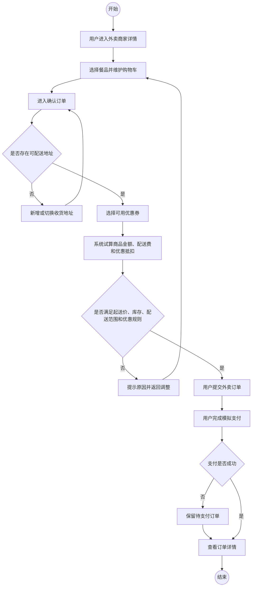
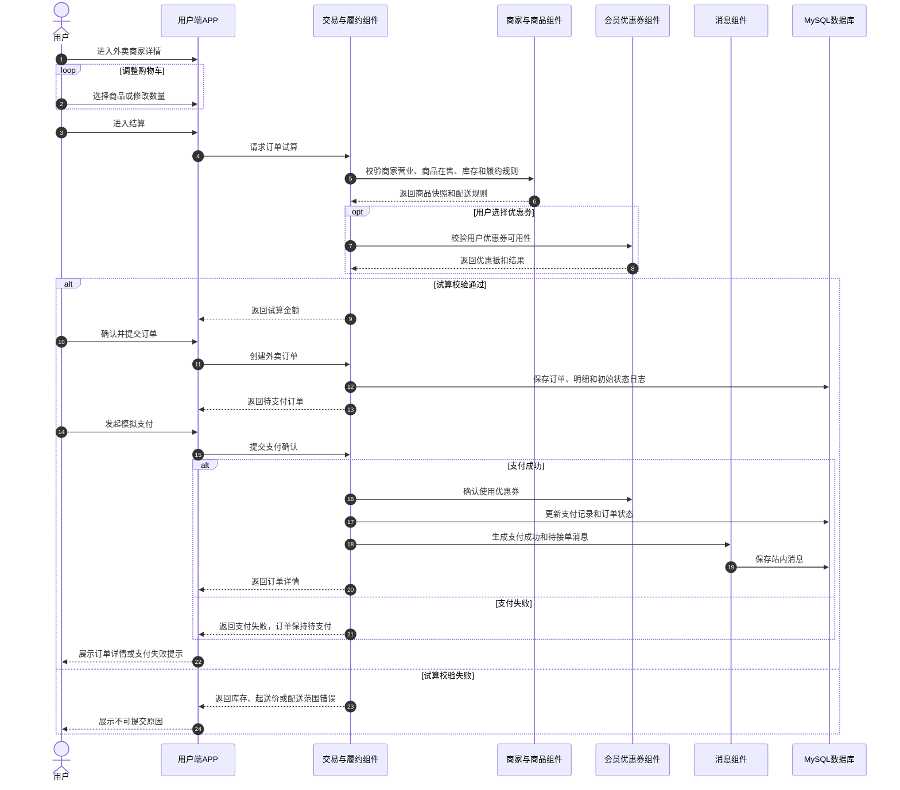
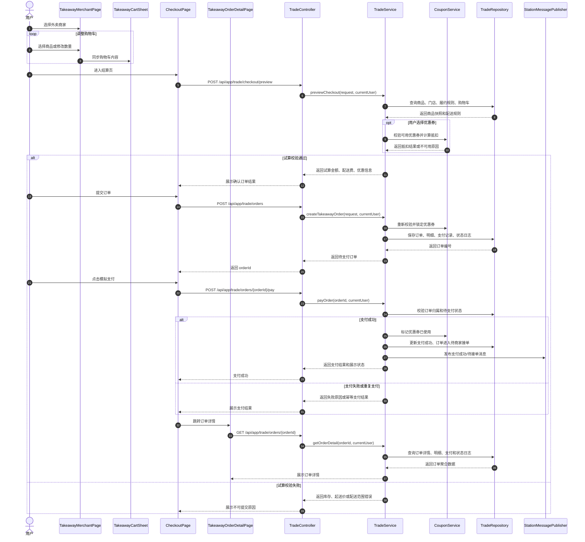
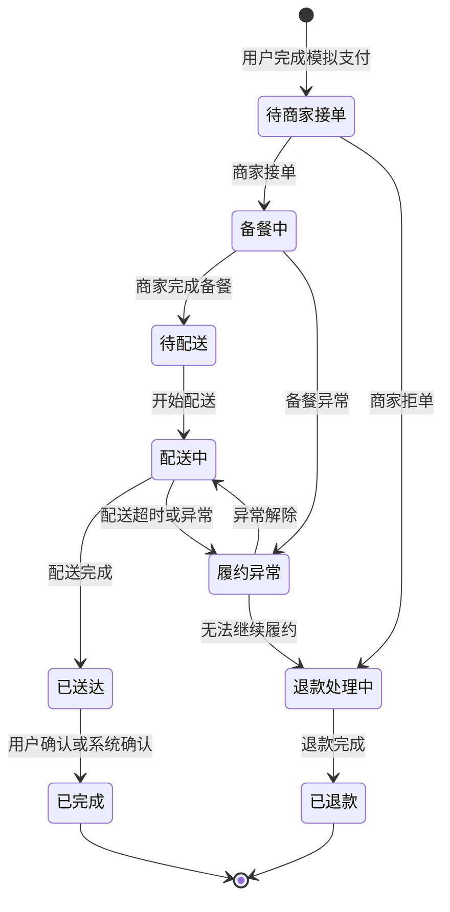
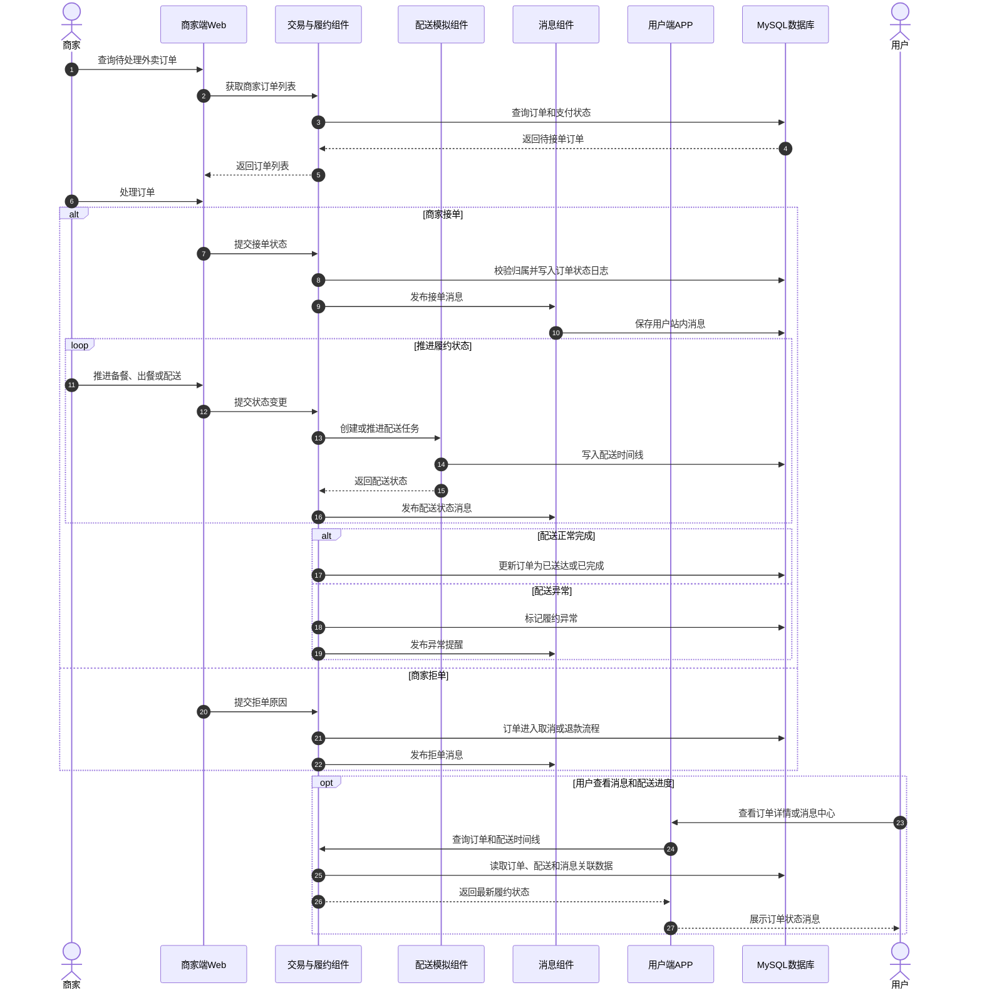
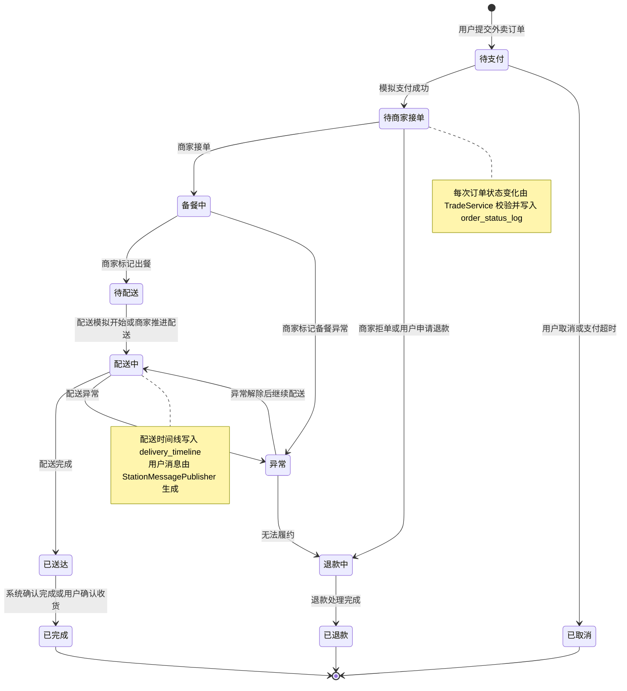

# UC04-UC05 用例三张图文档

本文档依据 `docs/stage-new-1/软工小学期.md` 和 `docs/stage-new-1/详细设计说明书-小学期修订版.md` 中的分工要求，为 UC04 和 UC05 分别补充需求层、概要层、详细层各一张 Markdown Mermaid 图。按照小学期要求，清单中的每个业务场景只绘制 1 张顺序图、状态图或活动图，图型限定为上述三类。

---

## 1. UC04 用户完成外卖点单、优惠结算和模拟支付，并查看订单详情

### 1.1 UC04 需求说明书系统级活动图

### 1.2 UC04 概要设计组件级顺序图

### 1.3 UC04 详细设计对象级顺序图

---

## 2. UC05 商家处理外卖订单并推进配送履约，用户接收订单状态消息

### 2.1 UC05 需求说明书系统级状态图

### 2.2 UC05 概要设计组件级顺序图

### 2.3 UC05 详细设计对象级状态图

