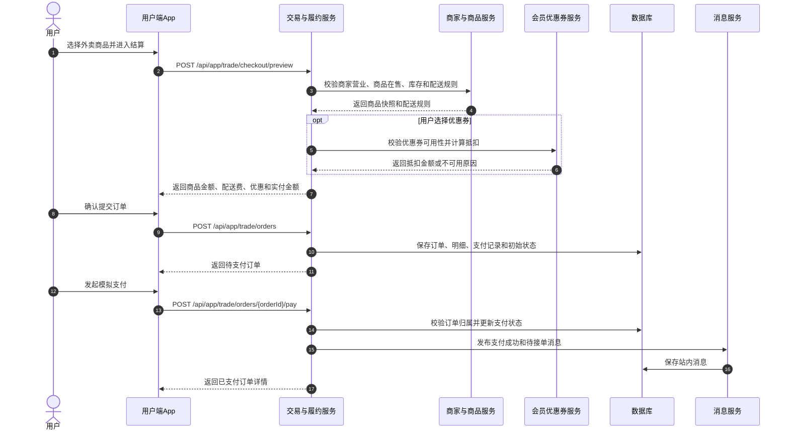
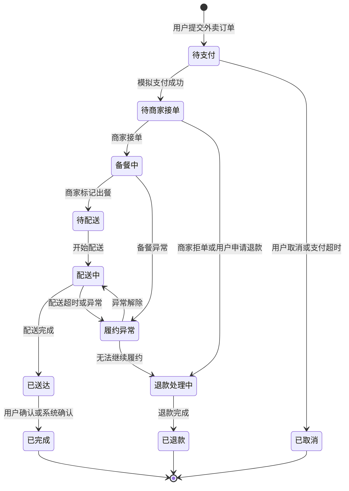
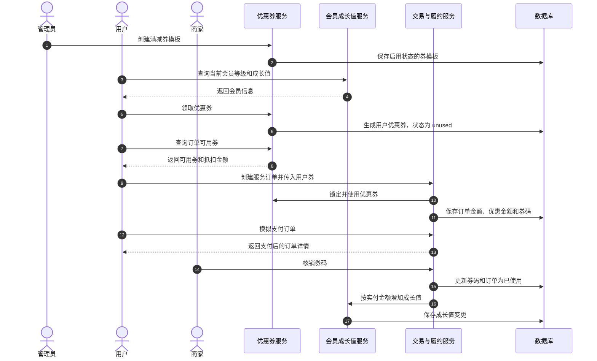
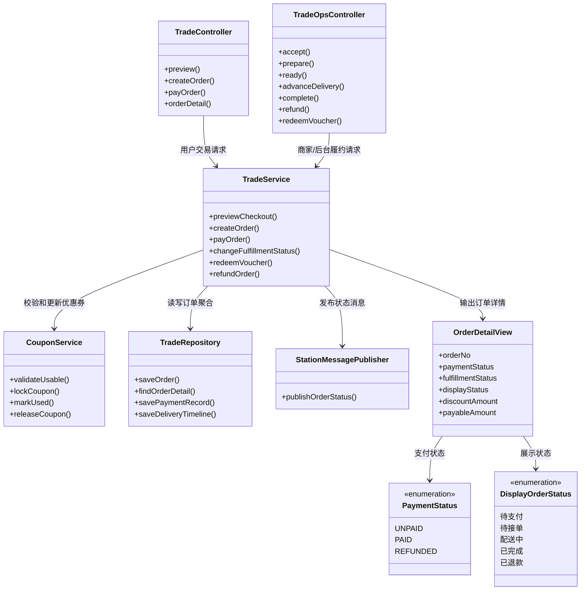

# UML 建模与测试追溯检查版

## 1. 整理口径

本材料不是中期检查式的全量设计汇总，也不覆盖全部 13 个业务用例。按照老师反馈，本次只选择几个最能体现建模能力和测试追溯关系的代表用例，重点回答三个问题：

1. UML 图是否画得规范，是否有明确的参与者、对象、消息、状态和职责边界。
2. 模型是否和当前系统代码一致，而不是为了展示随意画图。
3. 是否能从模型推导出集成测试和端到端测试用例，体现“模型是代码正确性的检查标准”。

因此，本材料选取以下场景：

| 选取内容 | 选择原因 | 对应测试资产 |
| --- | --- | --- |
| UC04 外卖下单、结算、模拟支付 | 覆盖用户端到后端的主交易链路，适合用系统顺序图推导接口测试。 | `tests/e2e/specs/uc04-takeaway-order-flow.spec.ts`、`TradeApiIntegrationTest.java`、`CouponApiIntegrationTest.java` |
| UC05 商家履约、配送推进、消息通知 | 覆盖订单生命周期和状态迁移，适合用状态图推导状态迁移测试。 | `tests/e2e/specs/uc05-delivery-fulfillment-flow.spec.ts`、`MessageApiIntegrationTest.java`、`StationMessagePublisherTest.java` |
| UC12 会员、优惠券、成长值 | 覆盖优惠券从创建、领取、抵扣、核销到成长值增长的规则闭环，适合展示模型到断言的细粒度追溯。 | `tests/e2e/specs/uc12-member-coupon-flow.spec.ts`、`CouponApiIntegrationTest.java`、`TradeGrowthServiceTest.java` |
| 交易与履约核心类图 | 说明 Controller、Service、Repository、Coupon、Message 的职责边界，避免顺序图只描述流程、不说明结构。 | 后端交易、优惠券、消息相关单元 / 集成测试 |

## 2. UC04 外卖下单支付系统顺序图

### 2.1 UML 图

### 2.2 从模型推导测试用例

| 模型消息 / 规则 | 生成的测试点 | 对应测试 | 关键断言 |
| --- | --- | --- | --- |
| `checkout/preview` 返回结算金额 | 结算试算不能返回空金额或负金额。 | `uc04-takeaway-order-flow.spec.ts` | `preview.payableAmount > 0` |
| `POST /orders` 创建订单 | 提交成功后必须生成订单，且初始支付状态为未支付。 | `uc04-takeaway-order-flow.spec.ts` | `order.id > 0`；`paymentStatus = unpaid` |
| `POST /orders/{orderId}/pay` 模拟支付 | 支付成功后订单支付状态必须变为已支付。 | `uc04-takeaway-order-flow.spec.ts` | `paymentStatus = paid` |
| 支付后进入商家履约队列 | 支付完成后履约状态应进入待商家处理或已接单。 | `uc04-takeaway-order-flow.spec.ts` | `fulfillmentStatus` 匹配 `merchant_pending|accepted` |
| 查询订单详情 | 订单详情必须和创建订单一致，且包含下单商品。 | `uc04-takeaway-order-flow.spec.ts` | `detail.orderNo = order.orderNo`；明细包含 `itemId=1002` |
| Controller、Service、Repository 协作 | API 响应结构、订单详情、支付参数和权限边界正确。 | `TradeApiIntegrationTest.java` | HTTP 状态码、统一响应、订单字段、角色边界符合预期 |

## 3. UC05 商家履约状态图

### 3.1 UML 图

### 3.2 从状态图推导测试用例

| 状态迁移 | 触发动作 | 对应测试 | 关键断言 |
| --- | --- | --- | --- |
| 待支付 → 待商家接单 | 用户模拟支付。 | `uc05-delivery-fulfillment-flow.spec.ts` | 支付后 `fulfillmentStatus` 匹配 `merchant_pending|accepted` |
| 待商家接单 → 备餐中 | 商家端点击“接单”“开始备餐”。 | `uc05-delivery-fulfillment-flow.spec.ts` | 商家端能找到该订单并执行操作成功 |
| 备餐中 → 待配送 | 商家端点击“出餐”。 | `uc05-delivery-fulfillment-flow.spec.ts` | 后续配送推进按钮可继续执行 |
| 待配送 → 配送中 → 已送达 | 商家端连续推进配送。 | `uc05-delivery-fulfillment-flow.spec.ts` | 配送时间线包含 `delivering`、`delivered` |
| 已送达 → 已完成 | 商家端点击“完成订单”。 | `uc05-delivery-fulfillment-flow.spec.ts` | `fulfillmentStatus = completed`；`displayStatus = used` |
| 状态变化发布消息 | 支付、接单、配送等节点写入站内消息。 | `uc05-delivery-fulfillment-flow.spec.ts`、`StationMessagePublisherTest.java` | 用户消息列表存在 `relatedOrderId = order.id` 的消息 |

## 4. UC12 会员优惠券顺序图

### 4.1 UML 图

### 4.2 从模型推导测试用例

| 模型消息 / 规则 | 生成的测试点 | 对应测试 | 关键断言 |
| --- | --- | --- | --- |
| 管理员创建满减券模板 | 券模板创建后必须处于启用状态。 | `uc12-member-coupon-flow.spec.ts` | `template.status = enabled` |
| 用户领取优惠券 | 领取后用户券必须为未使用。 | `uc12-member-coupon-flow.spec.ts` | `status = unused` |
| 查询订单可用券 | 满足门槛时优惠券必须可用，抵扣金额正确。 | `uc12-member-coupon-flow.spec.ts` | `usable = true`；`discountAmount = 12` |
| 下单并使用优惠券 | 支付后订单优惠金额和实付金额必须正确。 | `uc12-member-coupon-flow.spec.ts` | `discountAmount = 12`；`payableAmount = 86` |
| 支付后券状态变更 | 已用于订单的优惠券不能继续作为可用券。 | `uc12-member-coupon-flow.spec.ts` | 用户券进入 `used`，`usedOrderId = created.id` |
| 商家核销券码 | 核销后订单和券码都应进入已使用状态。 | `uc12-member-coupon-flow.spec.ts` | `displayStatus = used`；`voucher.status = used` |
| 订单完成增加成长值 | 成长值按实付金额整数部分增加。 | `uc12-member-coupon-flow.spec.ts`、`TradeGrowthServiceTest.java` | `memberAfter.growthValue = memberBefore.growthValue + floor(payableAmount)` |

## 5. 交易与履约核心类图

### 5.1 UML 图

### 5.2 从类图推导测试边界

| 模型元素 | 测试边界 | 对应测试 |
| --- | --- | --- |
| `TradeController` | 用户端订单、结算、支付、详情接口的请求 / 响应契约。 | `TradeApiIntegrationTest.java`、UC04 E2E |
| `TradeOpsController` | 商家端接单、备餐、出餐、配送、完成、退款、核销接口。 | UC05 E2E、UC06 E2E、UC08 E2E |
| `TradeService` | 订单状态机和业务规则，不能只测 Controller 返回。 | `TradeGrowthServiceTest.java`、`TradeApiIntegrationTest.java` |
| `CouponService` | 优惠券可用、锁定、使用、释放规则。 | `CouponApiIntegrationTest.java`、UC12 E2E |
| `TradeRepository` | 订单、支付记录、状态日志、配送时间线等持久化结果。 | 后端集成测试、UC04 / UC05 API 回查 |
| `StationMessagePublisher` | 订单关键状态变化后必须产生用户可见消息。 | `StationMessagePublisherTest.java`、`MessageApiIntegrationTest.java`、UC05 E2E |

## 6. 追溯结论

本材料只选择 UC04、UC05、UC12 三个代表性用例，而不是罗列全部用例。选择依据是：这三个用例分别覆盖交易主链路、状态迁移链路和会员优惠规则链路，且都有已经落地的自动化测试。

| 模型 | 模型作用 | 对应代码 / 接口 | 对应测试 | 结果 |
| --- | --- | --- | --- | --- |
| UC04 系统顺序图 | 推导结算、下单、支付、详情查询的接口顺序和断言。 | `TradeController`、`TradeService`、`CouponService` | `uc04-takeaway-order-flow.spec.ts`、`TradeApiIntegrationTest.java` | 通过 |
| UC05 状态图 | 推导订单履约状态迁移和消息通知检查点。 | `TradeOpsController`、`TradeService`、`StationMessagePublisher` | `uc05-delivery-fulfillment-flow.spec.ts`、`MessageApiIntegrationTest.java` | 通过 |
| UC12 顺序图 | 推导优惠券创建、领取、抵扣、核销、成长值增长规则。 | `CouponController`、`CouponService`、`TradeService`、`MemberService` | `uc12-member-coupon-flow.spec.ts`、`TradeGrowthServiceTest.java` | 通过 |
| 交易与履约核心类图 | 明确接口层、业务层、数据层和消息发布职责边界。 | `services/backend/src/main/java/com/aituan/trade`、`coupon`、`message` | 后端单元 / 集成测试和 E2E 测试 | 通过 |

通过上述追溯可以看出，本次建模不是单独画图，而是把 UML 模型转化为接口调用顺序、状态迁移规则、类职责边界和测试断言。代码是否正确，最终按照模型中的消息、状态和职责进行检查。