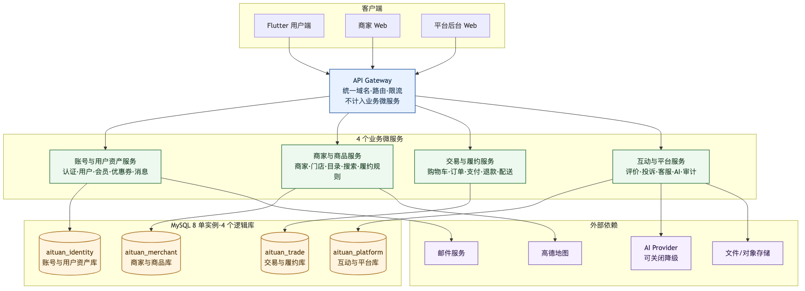
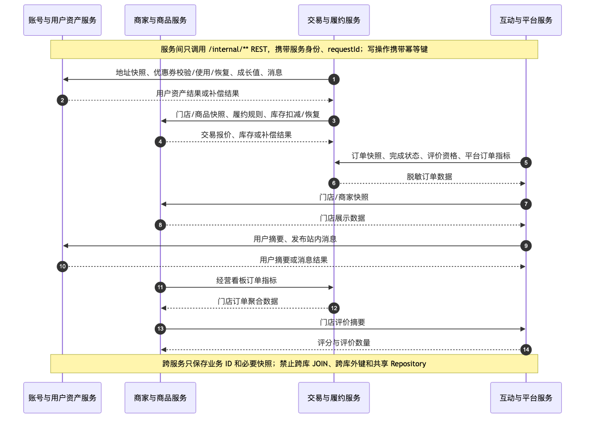

# 爱团四微服务划分设计

## 1. 文档目标

本文档用于中期检查的微服务设计交付，在不改动当前模块化单体代码的前提下，确定后续物理拆分的服务边界、路由归属、数据所有权和跨服务协作规则。

当前系统仍是 `services/backend/` 中的一个 Spring Boot 应用；本设计是目标架构，不表示本轮已完成代码、数据库或部署迁移。

## 2. 总体结论

系统拆分为 **4 个业务微服务**，API Gateway 仅作为入口基础设施，不计入业务微服务数量。一个 MySQL 8 实例中创建 4 个逻辑库，每个服务只能访问自己的数据库。

Mermaid 源文件：[MS_SERVICE_BOUNDARY.mmd](./diagrams/MS_SERVICE_BOUNDARY.mmd)。

| 服务 | 建议工程名 | 核心职责 | 逻辑库 |
| --- | --- | --- | --- |
| 账号与用户资产服务 | `identity-asset-service` | 登录鉴权、用户资料、地址收藏、会员、优惠券、站内消息 | `aituan_identity` |
| 商家与商品服务 | `merchant-catalog-service` | 商家入驻、门店资质、商品目录、搜索推荐、履约规则 | `aituan_merchant` |
| 交易与履约服务 | `trade-fulfillment-service` | 购物车、结算、订单、支付、退款、券码、预约、配送 | `aituan_trade` |
| 互动与平台服务 | `engagement-platform-service` | 评价、投诉、客服、AI 助手、公告配置、审计、平台看板 | `aituan_platform` |

## 3. 服务边界

### 3.1 账号与用户资产服务

- 拥有账号、角色、用户档案及个人资产的最终修改权。
- 保留当前 JWT 中已有的 `accountId`、`userId`、`accountType` 和 `displayName` 声明；其他服务使用共享验签材料本地验证。商家业务需要 `merchantId` 时，通过商家服务的账号映射内部接口获取并短时缓存，不跨库查询 `merchant_profile`。
- 优惠券校验、占用/使用/恢复、会员成长值和站内消息发布仅能通过该服务修改。

### 3.2 商家与商品服务

- 拥有商家、门店、资质、商品、库存和履约规则。
- 对用户端提供首页、搜索、门店和商品详情；对交易服务提供下单快照、配送规则和库存动作。
- 商家经营看板在该服务对外提供，其订单指标和评价指标分别通过内部接口向交易服务、互动平台服务聚合。

### 3.3 交易与履约服务

- 是订单状态机、支付/退款记录、券码、预约和配送任务的唯一所有者。
- 下单时读取用户地址、优惠券以及门店/商品/履约规则，并把价格、名称、地址等必要信息固化为订单快照。
- 跨服务写操作采用幂等 REST 与补偿：库存扣减失败不使用优惠券；后续步骤失败则恢复库存/优惠券并记录可重试状态。

### 3.4 互动与平台服务

- 拥有评价、投诉、客服会话、AI 会话、平台配置、公告、审计和文件元数据。
- 提交评价前向交易服务核对订单所属人及完成状态；投诉和客服仅保存订单、用户、门店业务 ID 与必要快照。
- AI 仅做编排和降级回复，通过各服务内部查询接口读取业务数据，不跨库读取。

## 4. Gateway 路由归属

Gateway 保留现有对外 URL，不要求 Flutter、商家 Web 或后台 Web 改接口地址。`/api/admin/**` 必须使用资源级路由优先级，不能整体转发给一个“万能后台服务”。

| 目标服务 | 主要对外路由 |
| --- | --- |
| 账号与用户资产 | `/api/open/auth/**`、`/api/app/account/**`、`/api/app/message*/**`、`/api/admin/users/**`、`/api/admin/operation/member-levels/**`、`/api/admin/operation/coupon-templates/**` |
| 商家与商品 | `/api/open/merchant/**`、`/api/app/discovery/**`、`/api/app/location/**`、商家资料/目录路由、后台商家/门店/目录路由，以及 `/api/{admin,merchant}/trade/stores/**` |
| 交易与履约 | `/api/app/trade/**`、`/api/{admin,merchant}/trade/{orders,bookings,vouchers}/**`、`/api/admin/delivery/tasks/**` |
| 互动与平台 | `/api/app/interaction/**`、`/api/app/complaints/**`、`/api/app/support/**`、`/api/app/ai/**`、商家互动路由、后台治理/公告/配置/审计路由、`/api/admin/delivery/settings`、`/api/common/files/**` |

完整的 227 个 HTTP 操作归属见[微服务接口清单](./微服务接口清单.md)。

Gateway 必须按最长路径优先匹配，不能仅按 `/api/*/trade/**` 粗粒度转发；门店规则/商品资源始终回到商家商品服务，平台配送配置始终回到平台配置所有者。

## 5. 现有代码模块迁移映射

| 现有包 | 目标服务 | 说明 |
| --- | --- | --- |
| `auth`、`account`、`member`、`coupon`、`message` | 账号与用户资产 | 保持当前业务聚合，消息发布改为内部接口 |
| `merchant`、`catalog`、`discovery` | 商家与商品 | `MapDistanceService` 作为该服务的外部地图适配器 |
| `trade` | 交易与履约 | 保持统一订单状态机，配送仍为服务内模块 |
| `interaction`、`complaint`、`support`、`ai` | 互动与平台 | 移除对交易、会员、消息表的直接访问 |
| `statistics` | 按看板拆分 | 商家看板归商家服务，平台看板归互动平台服务 |
| `admin` | 按资源拆分 | 用户、商家、交易和平台管理接口回到各自的领域服务 |
| `common.api/security/exception` | 共享库 | 只保留响应、鉴权声明、错误码等无业务状态的公共契约 |
| `common.file` | 互动与平台 | 统一文件入口，其他服务只保存文件 URL |

## 6. UC01–UC23 主责与协作映射

| 用例 | 主责服务 | 协作服务 |
| --- | --- | --- |
| UC01 注册登录 | 账号与用户资产 | 无 |
| UC02 首页与八大模块 | 商家与商品 | 互动与平台（评分摘要） |
| UC03 搜索与详情 | 商家与商品 | 互动与平台（评价摘要） |
| UC04 资料、地址、收藏 | 账号与用户资产 | 商家与商品（收藏目标快照） |
| UC05 外卖下单支付 | 交易与履约 | 账号与用户资产、商家与商品 |
| UC06 商家接单配送 | 交易与履约 | 商家与商品、账号与用户资产（消息） |
| UC07 订单与配送时间线 | 交易与履约 | 无 |
| UC08 非外卖券码/预约 | 交易与履约 | 商家与商品、账号与用户资产 |
| UC09 券码核销/预约确认 | 交易与履约 | 账号与用户资产（成长值/消息） |
| UC10 取消与退款 | 交易与履约 | 账号与用户资产、商家与商品 |
| UC11 用户发布评价 | 互动与平台 | 交易与履约、商家与商品 |
| UC12 评价回复与治理 | 互动与平台 | 账号与用户资产（消息） |
| UC13 客服会话 | 互动与平台 | 账号与用户资产、商家与商品 |
| UC14 投诉处理 | 互动与平台 | 交易与履约、账号与用户资产 |
| UC15 会员成长值与领券 | 账号与用户资产 | 交易与履约（订单金额） |
| UC16 会员等级与券模板 | 账号与用户资产 | 无 |
| UC17 门店与履约规则 | 商家与商品 | 无 |
| UC18 商品/服务目录 | 商家与商品 | 无 |
| UC19 商家入驻与资质 | 商家与商品 | 账号与用户资产（账号） |
| UC20 平台业务对象治理 | 各资源所属服务 | 互动与平台（聚合入口） |
| UC21 看板、公告、配置、审计 | 互动与平台 | 其他三个服务（统计摘要） |
| UC22 站内消息 | 账号与用户资产 | 其他三个服务（消息生产方） |
| UC23 AI 助手 | 互动与平台 | 账号与用户资产、商家与商品、交易与履约 |

## 7. 跨服务协作与补偿

Mermaid 源文件：[MS_SERVICE_CALLS.mmd](./diagrams/MS_SERVICE_CALLS.mmd)。

| 链路 | 同步调用 | 失败处理 |
| --- | --- | --- |
| 下单支付 | 交易 → 用户资产（地址/优惠券）；交易 → 商家商品（快照/库存） | 任一占用失败不进入支付成功；已完成的占用通过原幂等键逆向释放 |
| 退款 | 交易 → 用户资产（恢复优惠券）；交易 → 商家商品（恢复库存） | 退款记录保留待补偿状态，定时重试，重复请求不重复恢复 |
| 评价 | 互动平台 → 交易（所属与可评价状态）；→ 商家商品（门店快照） | 订单校验不可用时拒绝写入评价 |
| 投诉 | 互动平台 → 交易（订单快照） | 无法确认订单所属时不创建工单 |
| 客服 | 互动平台 → 商家商品/交易（会话上下文）；→ 用户资产（站内消息） | 业务上下文失效时仍保留会话，展示快照并提示数据不可用 |
| AI | 互动平台 → 其他三服务的只读内部接口 | 单个工具超时只影响对应卡片，返回现有确定性降级文案 |

## 8. 通信与安全约定

1. 外部请求继续使用用户/商家/管理员 JWT，Gateway 只做粗粒度路由和限流，业务服务必须再做角色与资源归属校验。
2. `/internal/**` 不对外暴露，使用独立服务凭证；同时传递 `X-Request-Id`、`X-Caller-Service`。
3. 所有内部写接口要求 `Idempotency-Key`，幂等范围为“调用方 + 业务动作 + 业务对象”。
4. 本阶段不引入消息队列和分布式事务；核心链路使用短超时、有界重试、幂等与补偿。
5. 服务不得直连其他逻辑库，不得使用跨库 JOIN 或跨库外键。

## 9. 后续物理拆分顺序

1. 先抽取统一响应、错误码、JWT 声明和请求追踪为无业务状态的共享库。
2. 优先拆出商家商品与互动平台两个读多写少领域，建立 Gateway 路由和内部只读接口。
3. 再拆账号用户资产，完成 JWT 本地验签与优惠券/消息内部接口。
4. 最后拆交易履约，用新的内部契约替代对用户、商家、优惠券和消息表的直接 SQL。
5. 每次只迁移一个领域，通过 Gateway 按路径切流，保留可回退的旧路由直到该域的回归测试通过。

## 10. 课程任务书符合性基线

本设计按《软件工程基础实践》课程任务书（2026 夏）第 3、5、6 页重新核对。任务书的硬约束及本方案的落实方式如下。

| 任务书要求 | 本方案落实方式 | 当前状态 |
| --- | --- | --- |
| 至少 3 个业务微服务，Gateway 不计数 | 划分为 4 个业务微服务，Nginx/Gateway 仅负责路由 | 设计完成，尚未物理拆分 |
| 每个服务独立构建、测试和部署 | 采用 Maven 多模块或四个独立 Spring Boot 工程，每个服务拥有独立启动类、数据源、Flyway 目录、镜像和健康检查 | 当前只有一个 `aituan-backend` 工程 |
| 每张业务表只有一个管理服务 | 60 张表全部唯一归属四个逻辑库和四个服务账号 | 归属设计已完成 |
| 其他服务不能直接读写该表，禁止跨服务联表 | 跨服务读取改为 `/internal/**` 契约或业务快照；写入使用幂等命令和补偿 | 当前单体仍有跨领域 SQL，拆库前必须替换 |
| 跨服务失败有处理办法 | 查询采用短超时、有限重试或快照降级；写操作采用幂等键、状态记录和反向补偿 | 契约已设计，待实现 |
| 所有公开接口有 API 测试，全部用例做 E2E 回归 | 外部 227 个 HTTP 操作保留原 URL；E2E 经 Gateway 执行 UC01–UC23 | 现有 E2E 只覆盖部分场景 |
| 支持 HPA 和故障处理实验 | 选择商家与商品服务做无状态读接口 HPA；停止商家服务验证交易超时、快照降级和故障隔离 | Kubernetes/HPA/熔断配置待后续实现 |

因此，本文件描述的是**可实施的目标架构和拆分验收门槛**，不是对当前仓库已经完成微服务改造的声明。

## 11. UC01–UC23 数据闭环与无跨库联表审查

审查原则是：服务内可以对本服务所属表进行 JOIN；一旦数据所有者不同，就只能使用内部接口、事件结果或在业务发生时保存的必要快照。下表逐项确认不存在“必须跨服务直接联表”才能完成的用例。

| 用例 | 主责服务内允许的查询 | 跨服务数据及替代方式 | 审查结论 |
| --- | --- | --- | --- |
| UC01 注册登录 | 账号、角色、用户档案均在用户资产库 | 无 | 单库闭环 |
| UC02 首页与八大模块 | 门店、分类、商品、推荐位在商家商品库内聚合 | 评分摘要调用互动服务；未读数和用户偏好调用用户资产服务 | 不需要跨库 JOIN |
| UC03 搜索与详情 | 门店、商品、SKU、分类在商家商品库内 JOIN | 评价摘要调用互动服务 | 不需要跨库 JOIN |
| UC04 资料、地址、收藏 | 用户档案、地址、收藏在用户资产库 | 新增收藏时调用商家服务获取名称、封面快照 | 快照后单库展示 |
| UC05 外卖下单支付 | 购物车、订单、明细、支付、配送在交易库 | 地址/优惠券调用用户资产；商品报价/库存调用商家服务 | 同步接口加补偿 |
| UC06 商家接单配送 | 订单、状态日志、配送任务在交易库 | `accountId→merchantId` 调商家服务；通知调用户资产服务 | 不查询商家/消息表 |
| UC07 订单与配送时间线 | 订单、明细、配送节点均在交易库 | 门店名称、地址和商品信息使用下单快照 | 单库闭环 |
| UC08 非外卖券码/预约 | 订单、券码、预约在交易库 | 商品/履约规则调商家服务，优惠券调用户资产服务 | 同步接口加快照 |
| UC09 券码核销/预约确认 | 券码、预约、订单状态在交易库 | 完成后调用用户资产增加成长值和发布消息 | 幂等命令 |
| UC10 取消与退款 | 订单、退款、券码、预约、状态日志在交易库 | 调用户资产恢复券/成长值，调商家服务恢复库存 | 退款记录驱动补偿 |
| UC11 发布评价 | 评价及互动数据在平台库 | 调交易服务校验归属/完成状态并标记已评价；调商家服务取门店快照 | 不更新交易表 |
| UC12 评价回复与治理 | 回复、举报、审核日志在平台库 | 消息通知调用用户资产服务 | 单库治理加通知 |
| UC13 客服会话 | 会话、消息、自动回复规则在平台库 | 用户、门店、订单上下文分别调用三个服务并保存快照 | 上下文失效仍可显示快照 |
| UC14 投诉处理 | 工单和处理日志在平台库 | 建单时获取订单/门店/用户快照，后续按工单号单库流转 | 不实时联表 |
| UC15 会员成长与领券 | 等级、成长日志、券模板、用户券在用户资产库 | 订单完成由交易服务发送幂等成长值命令 | 单库资产核算 |
| UC16 等级与券模板配置 | 等级、券模板、周券规则均在用户资产库 | 无 | 单库闭环 |
| UC17 门店与履约规则 | 商家、门店、配送和接单规则在商家商品库 | 无 | 单库闭环 |
| UC18 商品/服务目录 | 分类、商品、SKU、标签在商家商品库 | 无 | 单库闭环 |
| UC19 商家入驻与资质 | 申请、资质、商家、门店、审核日志在商家商品库 | 通过审核时调用用户资产服务幂等创建商家账号，失败则保持“账号待创建”可重试状态 | Saga 式状态补偿 |
| UC20 平台业务对象治理 | 各资源仍由其所属服务管理 | 后台按资源路由到对应服务；平台服务只聚合内部查询结果 | 不建设万能后台库 |
| UC21 看板、公告、配置、审计 | 公告、配置、审计在平台库 | 订单、商家、用户和互动指标由各服务返回聚合值 | 指标聚合不传底表 |
| UC22 站内消息 | 站内消息在用户资产库 | 其他服务仅调用消息发布命令 | 单库闭环 |
| UC23 AI 助手 | AI 会话和消息在平台库 | AI skill 改为调用四服务只读契约；超时返回确定性降级文案 | 禁止 AI 直连其他库 |

审查结论：**目标架构下 23 个用例均可通过服务内查询、内部接口和必要快照完成，没有必须跨服务直接联表的场景。** 当前模块化单体中的跨领域 SQL 属于待替换实现，不是业务上的必需关系。

## 12. 结合当前代码的可实现性

### 12.1 可直接复用的结构

当前后端为 Java 17、Spring Boot 3.4.6 和 JdbcTemplate，共 129 个 Java 文件，已经形成 `auth/account/member/coupon/message`、`merchant/catalog/discovery`、`trade`、`interaction/complaint/support/ai` 等垂直业务包。大多数包具备独立的 Controller、Service、Repository 和 DTO，外部路径也由 Controller 明确声明。

| 当前能力 | 代码证据 | 拆分时复用方式 |
| --- | --- | --- |
| 外部 API 边界 | 各领域 Controller 已按 `/api/app`、`/api/merchant`、`/api/admin` 分组 | 保留 Controller 和 DTO，Gateway 维持原 URL |
| 业务层与持久层分离 | 各领域已有 Service/Repository | 将本服务自有表 SQL 随包迁移，不改业务规则 |
| 无跨领域 ORM 实体图 | Repository 统一使用 JdbcTemplate | 替换跨域 SQL 时无需重建 JPA 聚合和级联关系 |
| 无状态鉴权基础 | `JwtTokenService`、`JwtAuthenticationFilter`、`CurrentUserContext` | 抽为共享安全库，各服务本地验签 |
| 请求追踪 | `RequestIdFilter` 已生成/透传 `X-Request-Id` | 内部调用继续透传同一 requestId |
| 独立端口和数据源参数 | `application.yml` 已支持 `SERVER_PORT`，开发配置使用环境变量数据源 | 每个服务使用独立端口、Schema 和账号 |
| 健康检查 | Actuator 已暴露 `health`、`info` | 每服务配置 liveness/readiness 和版本信息 |
| 容器入口 | 已有 Java 17 JRE Dockerfile 和 Nginx 反向代理 | Dockerfile 改为接收不同服务 JAR；Nginx 增加资源级路由 |

### 12.2 必须替换、但不需要全盘重写的热点

| 当前代码热点 | 当前直接访问 | 目标改造 |
| --- | --- | --- |
| `TradeRepository` / `TradeService` | 直接读 `user_address`、`catalog_*`、`merchant_*`，并直接调用 Coupon/Member/Message 类 | 保留订单状态机和交易表 SQL；引入用户资产、商家商品 HTTP Client 替换跨域查询/方法调用 |
| `DiscoveryRepository` | 推荐查询 JOIN `user_favorite`、`order_*`，并查询 `review_record`、`support_station_message` | 用户偏好、购买偏好、评价摘要和未读数改为三个内部汇总接口 |
| `InteractionRepository` | JOIN `order_*`、`merchant_store`、`user_profile`，并更新 `order_item.is_reviewed` | 发布评价前调用交易资格接口；门店/用户用快照；标记已评价改为交易幂等命令 |
| `ComplaintRepository`、`SupportRepository` | JOIN 订单、门店和用户表 | 创建时保存订单号、门店名、用户昵称等快照，列表只查平台库 |
| `AiSkill` 各实现 | 多个 skill 直接使用 JdbcTemplate 查询四个领域 | 保留 skill 编排与响应模型，把查询实现替换成内部 REST Client |
| `AdminRepository` | 同时管理账号、商家、订单、配送和平台表 | 按既有外部路径拆到资源所属服务，不保留跨域 Repository |
| `StatisticsService/Repository` | 商家/订单/评价/投诉/客服多表聚合 | 商家看板由商家服务聚合交易与互动指标；平台看板聚合四服务汇总 DTO |

物理拆分采用“包迁移 + 端口适配器替换”而不是重新设计所有 Controller、DTO 和业务规则。建议顺序是：

1. 先抽取仅含 `ApiResponse`、错误码、JWT 验签、请求追踪的 `common-contract`。
2. 创建四个 Spring Boot 启动模块，把只访问自有表的包原样迁入。
3. 为上表热点先定义 Java 接口，再用单体内实现验证，最后替换为 HTTP Client。
4. 将 `admin` 和 `statistics` 按外部路由拆开，不整体搬到某个服务。
5. 逐服务切换 Gateway 路由，完成一个领域的 API/E2E 回归后再切下一个。

## 13. 独立启动、回归测试与云原生实验适配

### 13.1 独立运行拓扑

| 进程 | 建议本地端口 | 数据库 | 独立启动要求 |
| --- | ---: | --- | --- |
| Nginx / API Gateway | 18080 | 无 | 只做静态资源、路由、限流和统一入口 |
| 账号与用户资产服务 | 18081 | `aituan_identity` | 邮件关闭时使用现有本地验证码降级；其他服务离线仍能启动 |
| 商家与商品服务 | 18082 | `aituan_merchant` | 地图使用现有 local provider；互动/交易不可用时基础目录仍可查询 |
| 交易与履约服务 | 18083 | `aituan_trade` | 依赖客户端延迟初始化，依赖离线不阻止 Spring 启动 |
| 互动与平台服务 | 18084 | `aituan_platform` | AI 关闭时使用现有确定性降级；对象存储不可用时健康状态可观测 |

每个服务必须具备独立 `pom.xml` 或 Maven module、独立 `@SpringBootApplication`、独立 Flyway 目录、独立测试和独立镜像。四个服务不能把“其他服务健康”作为启动条件；依赖故障只能影响相关请求。

当前 `database/seeds/R__seed_demo_data.sql` 同时写四个领域，物理拆分时必须按表归属拆成四份测试数据脚本；当前迁移脚本中没有数据库外键，降低了拆库难度。

### 13.2 UC01–UC23 端到端回归

外部 URL 保持不变，Playwright 只访问 Gateway，因此已有页面定位器和 API Client 可以继续使用。测试启动器由“单后端进程”改为“Gateway + 四服务 + 四个 H2/MySQL Schema”，每个用例动态生成数据并可独立运行。

当前 `tests/e2e/` 只有 6 个 spec，且文件名使用旧分工编号。迁移到课程确认清单时必须重新登记：

| 现有 spec | 对应课程用例 |
| --- | --- |
| `uc08-refund-flow.spec.ts` | UC10 取消与退款 |
| `uc09-review-governance-flow.spec.ts` | UC11 发布评价、UC12 回复与治理 |
| `uc10-complaint-flow.spec.ts` | UC14 投诉处理 |
| `uc11-support-ai-flow.spec.ts` | UC13 客服会话、UC23 AI 助手 |
| `uc12-member-coupon-flow.spec.ts` | UC15 会员成长与领券；UC16 仍需补独立配置回归 |
| `uc13-merchant-catalog-flow.spec.ts` | UC17 门店规则、UC18 商品目录 |

现有测试可作为迁移后回归骨架，但不能据此声称 UC01–UC23 已全部覆盖。最终验收门槛为：

- 227 个公开 HTTP 操作都有 API 测试；
- `E2E-TC01` 至 `E2E-TC23` 全部通过；
- 每个测试报告记录 Gateway 和四服务版本、通过数、失败数及运行环境；
- 任一 API/E2E 失败时流水线停止，不制作或部署后续镜像；
- 可分别启动单个服务执行其单元/契约测试，也可启动完整拓扑执行 E2E。

### 13.3 两项云原生实验

| 实验 | 选择与理由 | 设计要求 | 验收证据 |
| --- | --- | --- | --- |
| 自动扩缩容 | 对商家与商品服务的 `GET /api/app/discovery/stores/search` 或 `/home` 压测；该服务读多、无会话、没有定时任务 | 设置 CPU/内存 requests/limits，HPA 例如 1–4 Pod、CPU 目标 60%；Pod 使用共享 MySQL，不写本地状态 | Pod 增减记录、吞吐量、平均/P95、错误率、CPU/内存 |
| 故障处理 | 主动停止商家与商品服务或注入延迟，观察交易和平台服务 | 内部客户端设置连接/读取超时；新下单返回明确“商家信息暂不可用”且不扣券/库存；历史订单使用交易快照继续展示；其他服务健康检查保持正常 | 故障注入命令、请求响应、各服务日志、健康检查和恢复记录 |

HPA 不能直接用于当前交易服务：`TradeDeliveryScheduler` 使用 `@Scheduled`，多副本会重复扫描配送任务。交易服务扩为多副本前必须采用数据库抢占、分布式锁或把调度器拆成单副本 Worker。平台服务当前本地文件策略也不适合多副本，需改为对象存储或共享卷。将 HPA 首选放在商家与商品服务，可在不掩盖这两个风险的前提下完成课程实验。

### 13.4 拆分完成验收门槛

- 四个服务分别执行构建和测试，任一失败均能单独定位。
- 四个服务在其他服务关闭时仍能完成 Spring 启动并返回自身健康状态。
- 四个数据库账号交叉查询均因权限不足而失败。
- UC01–UC23 经 Gateway 完成端到端回归，不直接调用服务私有端口。
- 停止一个依赖服务时只影响相关功能，已设计的提示、快照或补偿可验证。
- HPA 实验中 Pod 数量可升可降，并保留原始指标和压力脚本。
