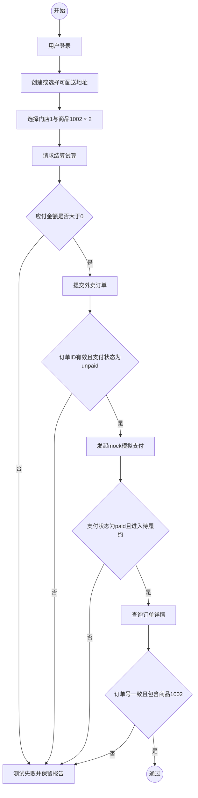
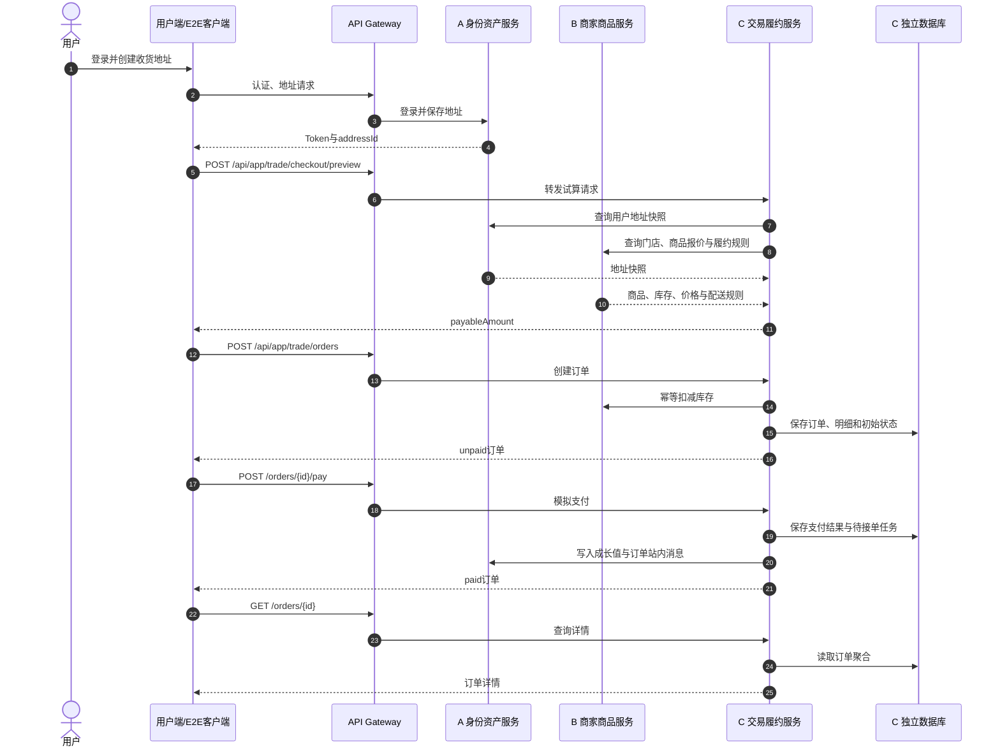
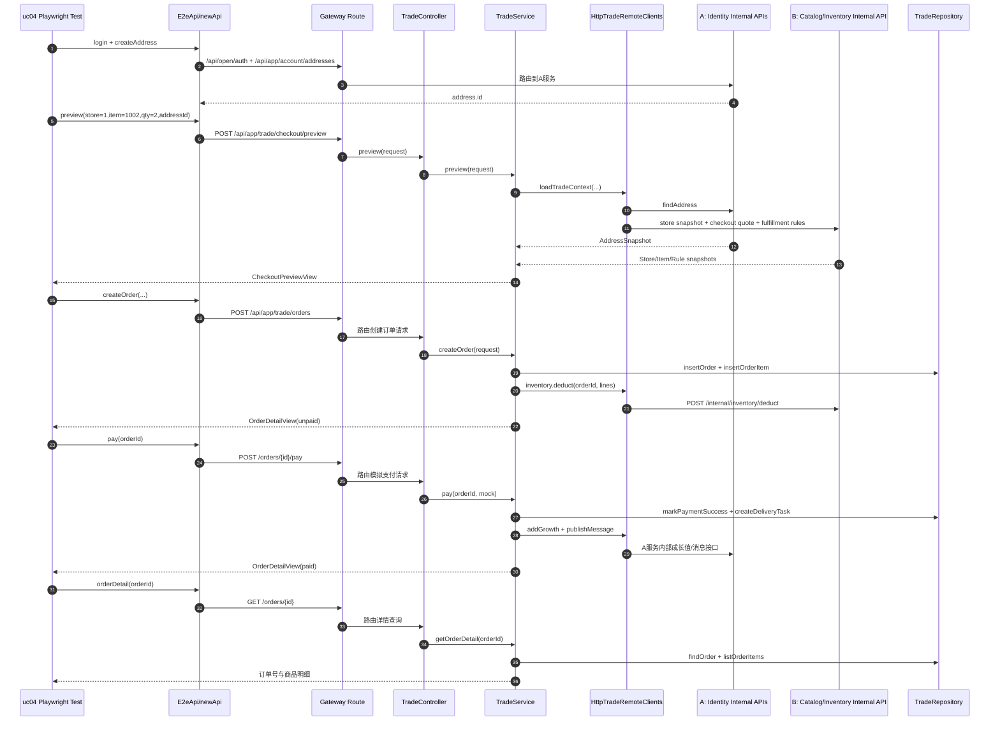
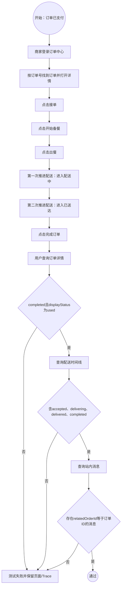
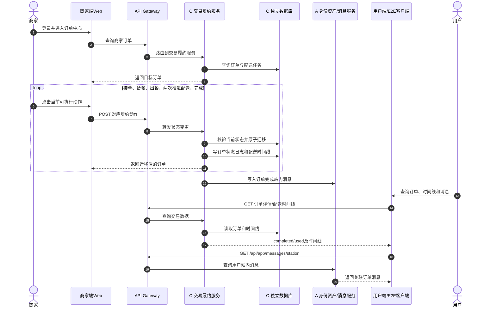
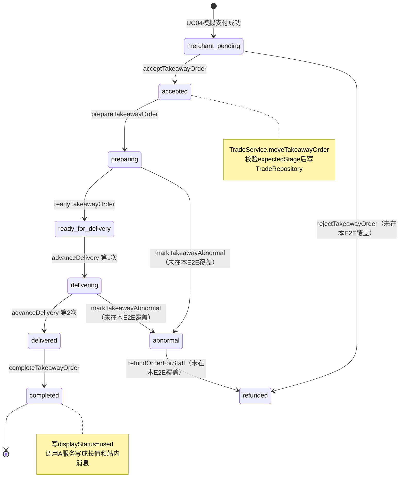
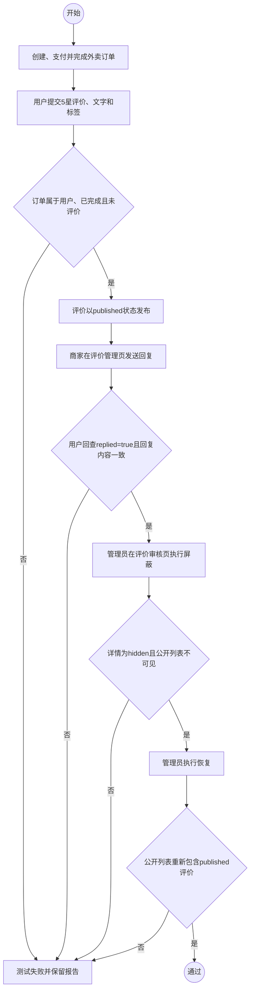
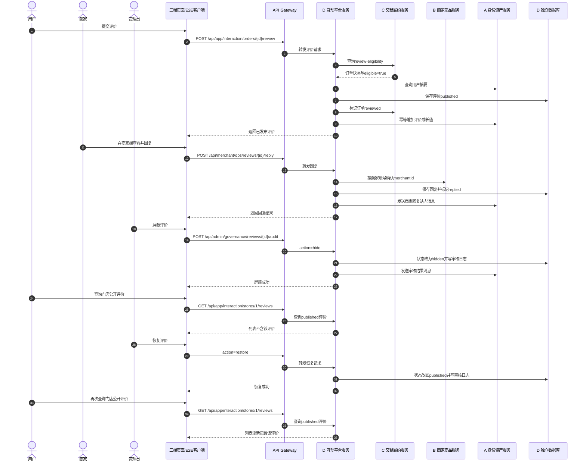
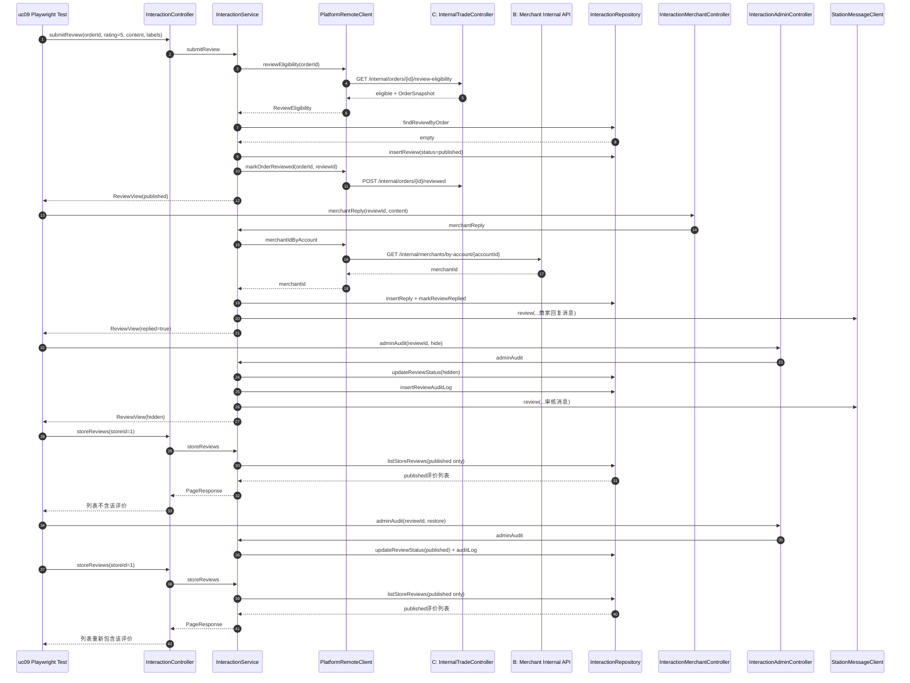

# 答辩三个代表性业务流程：模型—代码—测试一致性修订稿

> 用途：作为最终答辩和三层模型返工的统一底稿。本文以当前微服务代码、Playwright E2E 用例和 `microservices-ci.yml` 为准，不沿用已错位的 PDF 图片编号。

## 1. 评分口径与选择结论

分工 PDF 第一点评分要求的核心是：所有业务场景的需求、三层模型、代码和测试能够一一对应，最终汇报至少重点讲 3 个代表性用例。这里的“三层模型”按仓库既有口径解释为：

1. 需求层：系统级活动图或状态图，描述参与者可观察的业务步骤；
2. 概要层：组件级顺序图，描述网关与 A/B/C/D 微服务之间的协作；
3. 详细层：对象级顺序图或状态图，描述当前代码中的 Controller、Service、Client、Repository 与页面对象。

最终建议讲以下三个用例：

| 顺序 | 代表性用例 | 适合答辩的原因 | 当前 E2E |
| --- | --- | --- | --- |
| 1 | **UC04 外卖下单、结算、模拟支付** | 是交易入口；一次流程经过网关、A 身份资产、B 商家商品、C 交易履约，容易解释微服务拆分价值。 | `uc04-takeaway-order-flow.spec.ts` |
| 2 | **UC05 商家接单并完成配送履约** | 承接 UC04；能用状态迁移解释“模型如何生成测试步骤”，同时覆盖商家端页面、C 服务、A 站内消息。 | `uc05-delivery-fulfillment-flow.spec.ts` |
| 3 | **UC09 用户评价、商家回复、平台治理** | 承接已完成订单；同时出现用户、商家、管理员三种角色，并以 D 服务为主协调 A/B/C，最能体现跨端、跨服务闭环。 | `uc09-review-governance-flow.spec.ts` |

三者可以串成一条完整故事线：

```text
用户下单并支付（UC04）
  → 商家接单、备餐、配送并完成（UC05）
  → 用户评价、商家回复、平台屏蔽与恢复（UC09）
```

不建议把 UC10 或 UC12 直接作为现成答辩图使用。二者 E2E 测试本身很好，但当前提交 PDF 中多张模型图内容错题，需要整套重画；UC04、UC05、UC09 只需修复错位/缺段的模型，且能形成连续叙事。

## 2. 人工读图核对结论

以下结论来自逐页渲染后人工查看图中参与者、动作、分支和标题，不是根据文件名或图片 OCR 猜测：

| 文档与位置 | 图片实际内容 | 结论 / 返工动作 |
| --- | --- | --- |
| `需求说明书.pdf` UC04（PDF 第 14 页） | 进入商家、选餐、地址、试算、校验、提交、支付 | 内容正确，可作为 UC04 需求层原图；本稿按 E2E 选中的成功路径重新整理。 |
| `概要设计说明书.pdf` UC04（PDF 第 12 页） | 商家接单、配送、用户收消息，实际属于 UC05 | **错图**；用本文 3.2 的 UC04 组件图替换。 |
| `详细设计说明书.pdf` UC04（PDF 第 18 页） | 试算、下单、支付、详情对象顺序 | 内容正确，但类路径仍偏单体口径；用本文 3.3 更新为当前微服务对象。 |
| `需求说明书.pdf` UC05（PDF 第 16 页） | 待商家接单、备餐、配送、完成及退款/异常分支 | 内容正确；答辩时只声称 E2E 覆盖其中的主成功路径。 |
| `概要设计说明书.pdf` UC05（PDF 第 13 页） | 用户选商品、结算、创建订单、支付，实际属于 UC04 | **错图**；用本文 4.2 的 UC05 组件图替换。 |
| `详细设计说明书.pdf` UC05（PDF 第 20 页） | 外卖订单与配送状态机 | 内容正确；本文 4.3 将测试实际经过的状态单独标清。 |
| `需求说明书.pdf` UC09（PDF 第 24 页） | 用户发布评价、商家回复、平台审核处置 | 内容正确。 |
| `概要设计说明书.pdf` UC08—UC09 页组（PDF 第 16—19 页） | PDF 第 16 页出现了一张完整评价图，但图注写成 UC08 退款；后续图号继续错位，另一个评价图又只覆盖用户发布阶段 | **内容虽存在但位置、图注和范围不可靠**；用本文 5.2 的完整组件图放回 UC09 正确位置。 |
| `详细设计说明书.pdf` UC09（PDF 第 28 页） | 评价发布、回复、审核对象顺序 | 内容基本正确；本文 5.3 更新为当前 D 服务与跨服务 Client。 |
| `需求说明书.pdf` UC12（PDF 第 29 页） | 实际是 UC09 的商家回复、举报与平台治理，图内标题也写成评价流程 | **错题**，不能作为 UC12 会员优惠券证据。 |
| `详细设计说明书.pdf` UC10（PDF 第 30 页） | 实际是取消/退款对象流程 | **错题**，不能作为投诉工单证据。 |

因此，现有追溯表中“所有模型均完整”的文字结论不能直接用于答辩；必须以本文的修订图替换上述错图后再导出最终 PDF。

---

## 3. UC04 外卖下单、结算、模拟支付

### 3.1 需求文字描述

| 项目 | 内容 |
| --- | --- |
| 参与者 | 用户；系统协作者为网关、A 身份资产服务、B 商家商品服务、C 交易履约服务。 |
| 前置条件 | `demo_user` 可登录；门店 1 正常营业；商品 1002 在售且库存充足；用户存在可配送地址。 |
| 主成功流程 | 用户登录并准备地址；选择门店与商品；系统试算；用户提交订单；系统生成未支付订单并扣减库存；用户模拟支付；订单进入待商家接单；用户查询订单详情。 |
| 本次测试选择的分支 | 不选择优惠券，验证主交易路径。优惠券是活动图中的可选分支，由 UC12 E2E 单独覆盖，不应在答辩时误称 UC04 已验证优惠券抵扣。 |
| 后置条件 | 订单 `paymentStatus=paid`；履约状态为 `merchant_pending` 或因自动推进成为 `accepted`；详情包含原订单号和商品 1002。 |
| 关键代码 | `TradeController`、`TradeService`、`HttpTradeRemoteClients`、`TradeRepository`；A 服务地址/消息内部接口；B 服务商品快照、报价和库存接口。 |

### 3.2 需求层：SYS-ACT-04 系统级活动图

该图按 E2E 实际执行顺序绘制；每个矩形节点都能在 3.5 的测试步骤中找到对应动作或断言。



### 3.3 概要层：CMP-SEQ-04 微服务组件顺序图



### 3.4 详细层：OBJ-SEQ-04 当前代码对象顺序图



### 3.5 E2E 测试流程与逐节点核对

测试源：`tests/e2e/specs/uc04-takeaway-order-flow.spec.ts`。

| 序号 | 自动化动作 | 核心断言 | 对应 SYS-ACT-04 节点 | 人工核对 |
| --- | --- | --- | --- | --- |
| 1 | 登录 `demo_user` | 登录成功并持有 Token | 用户登录 | 一致 |
| 2 | 创建地址 | 返回 `address.id` | 创建或选择可配送地址 | 一致 |
| 3 | 门店 1、商品 1002×2 试算 | `payableAmount > 0` | 选择商品、请求试算、金额判断 | 一致 |
| 4 | 创建订单 | `id > 0`；`paymentStatus=unpaid` | 提交订单、未支付状态判断 | 一致 |
| 5 | 模拟支付 | `paymentStatus=paid`；履约状态匹配 `merchant_pending|accepted` | mock 支付、进入待履约 | 一致 |
| 6 | 查询详情 | 订单号一致；明细包含商品 1002 | 查询详情、订单一致性判断 | 一致 |

补充测试证据：`TradeCheckoutPreviewApiIntegrationTest` 覆盖试算金额和未达起送价分支；`TradeLifecycleApiIntegrationTest` 覆盖创建幂等、支付、详情/时间线和非法支付模式。

---

## 4. UC05 商家接单并完成配送履约

### 4.1 需求文字描述

| 项目 | 内容 |
| --- | --- |
| 参与者 | 用户、商家；系统协作者为网关、C 交易履约服务、A 身份资产/消息服务。 |
| 前置条件 | UC04 已产生已支付外卖订单；商家可登录并拥有该门店；商家端订单中心可访问。 |
| 主成功流程 | 商家找到订单；依次接单、开始备餐、出餐、推进至配送中、推进至已送达、完成订单；用户查询最终状态、配送时间线和站内消息。 |
| 本次测试选择的分支 | 只验证正常履约路径；拒单、备餐异常、配送异常和退款分支仍属于需求，但不在本条 E2E 的通过结论内。 |
| 后置条件 | `fulfillmentStatus=completed`、`displayStatus=used`；时间线含 accepted、delivering、delivered、completed；存在关联订单消息。 |
| 关键代码 | `TradeOpsController`、`TradeService.moveTakeawayOrder`、`TradeRepository`、`HttpTradeRemoteClients.order`；商家端订单中心和 A 服务消息接口。 |

### 4.2 需求层：SYS-ACT-05 系统级活动图



### 4.3 概要层：CMP-SEQ-05 微服务组件顺序图



### 4.4 详细层：OBJ-STATE-05 当前代码状态图

粗边主路径即本条 E2E 实际执行的状态序列；异常状态只作为需求边界，不计入本条测试通过范围。



### 4.5 E2E 测试流程与逐节点核对

测试源：`tests/e2e/specs/uc05-delivery-fulfillment-flow.spec.ts`。

| 序号 | 自动化动作 | 核心断言 | 对应 SYS-ACT-05 / OBJ-STATE-05 | 人工核对 |
| --- | --- | --- | --- | --- |
| 1 | 用户创建并支付订单 | 初始履约状态为 `merchant_pending|accepted` | 开始节点 | 一致 |
| 2 | 商家登录并在订单中心定位订单 | 行和订单号可见 | 登录、查单 | 一致 |
| 3 | 接单、开始备餐、出餐 | 每个按钮操作出现成功反馈 | `merchant_pending→accepted→preparing→ready_for_delivery` | 一致 |
| 4 | 连续两次推进配送 | 操作成功 | `ready_for_delivery→delivering→delivered` | 一致 |
| 5 | 完成订单 | 最终 `completed/used` | `delivered→completed` | 一致 |
| 6 | 查询配送时间线 | 含 accepted、delivering、delivered、completed | 时间线判断 | 一致 |
| 7 | 查询消息 | 有 `relatedOrderId=order.id` 且标题非空 | 站内消息判断 | 一致 |

需要在答辩中准确表述：测试点击了“开始备餐”和“出餐”，但最终断言主要通过动作成功反馈与配送时间线完成；它没有单独回查 `preparing` 和 `ready_for_delivery` 两个中间状态，也没有覆盖拒单/异常分支。

---

## 5. UC09 用户评价、商家回复、平台治理

### 5.1 需求文字描述

| 项目 | 内容 |
| --- | --- |
| 参与者 | 用户、商家、平台管理员；系统协作者为网关、D 互动平台服务、C 交易履约服务、B 商家商品服务、A 身份资产/消息/成长值服务。 |
| 前置条件 | 外卖订单属于当前用户且已完成；同一订单尚未评价；商家拥有订单所属门店；管理员可登录后台。 |
| 主成功流程 | 用户发布五星评价；D 向 C 校验订单评价资格并标记已评价；商家在商家端回复；管理员在后台屏蔽评价；公开列表不再显示；管理员恢复评价；公开列表重新显示。 |
| 本次测试选择的分支 | 验证平台主动屏蔽和恢复；没有提交“用户举报”，因此答辩不能声称本 E2E 覆盖举报入口。 |
| 后置条件 | 评价最终状态为 `published`；商家回复持久化；屏蔽期间公开列表不可见；恢复后公开列表包含该评价；跨服务副作用具备补偿/降级机制。 |
| 关键代码 | D 服务 `InteractionController`、`InteractionMerchantController`、`InteractionAdminController`、`InteractionService`、`InteractionRepository`、`PlatformRemoteClient`、`StationMessageClient`；C 服务内部评价资格接口。 |

### 5.2 需求层：SYS-ACT-09 系统级活动图



### 5.3 概要层：CMP-SEQ-09 微服务组件顺序图



### 5.4 详细层：OBJ-SEQ-09 当前代码对象顺序图



### 5.5 E2E 测试流程与逐节点核对

测试源：`tests/e2e/specs/uc09-review-governance-flow.spec.ts`。

| 序号 | 自动化动作 | 核心断言 | 对应 SYS-ACT-09 节点 | 人工核对 |
| --- | --- | --- | --- | --- |
| 1 | 创建、支付并完成外卖订单 | `displayStatus=used`；`fulfillmentStatus=completed` | 准备可评价订单 | 一致 |
| 2 | 用户提交五星评价 | `review.status=published` | 提交、资格校验、发布 | 一致 |
| 3 | 商家端打开评价管理并回复 | 页面出现“回复已发送” | 商家回复 | 一致 |
| 4 | 用户 API 回查评价 | `replied=true`；回复内容一致 | 回复回查判断 | 一致 |
| 5 | 管理员后台屏蔽 | 页面出现“已屏蔽”；详情 `status=hidden` | 平台屏蔽 | 一致 |
| 6 | 查询门店公开评价 | 列表不包含该评价 | 屏蔽可见性判断 | 一致 |
| 7 | 管理员恢复并再次查询公开列表 | 列表包含相同 ID 且 `status=published` | 恢复及最终判断 | 一致 |

补充测试证据：`PlatformRemoteClientTest` 验证 D→A/B/C 内部调用的服务身份头、幂等键、超时和 GET 重试边界；`ReviewOrderMarkCompensationTest` 验证“评价已保存但 C 服务标记失败”的补偿；`StationMessageClientTest` 验证通知失败不会回滚主业务。

---

## 6. 三个用例与当前微服务代码的总追溯

| 用例 | 需求层模型 | 概要层模型 | 详细层模型 | 主要服务 | 自动化测试 | 结论 |
| --- | --- | --- | --- | --- | --- | --- |
| UC04 | SYS-ACT-04 | CMP-SEQ-04 | OBJ-SEQ-04 | Gateway + A + B + C | UC04 E2E、C 服务试算/生命周期集成测试 | 主成功路径可一一对应；优惠券分支由 UC12 覆盖。 |
| UC05 | SYS-ACT-05 | CMP-SEQ-05 | OBJ-STATE-05 | Gateway + C + A | UC05 E2E、C 服务履约 API 测试、A 消息测试 | 正常履约路径可一一对应；拒单/异常不属于本 E2E 结论。 |
| UC09 | SYS-ACT-09 | CMP-SEQ-09 | OBJ-SEQ-09 | Gateway + D + C + B + A | UC09 E2E、D 远程契约/补偿/消息降级测试 | 发布—回复—屏蔽—恢复闭环可一一对应。 |

`aituan-microservices-ci` 会启动网关与 A/B/C/D 四个服务、四个独立 schema 和三端 Web，然后以 `E2E_API_ORIGIN=http://127.0.0.1:18080` 通过网关运行 UC01—UC13。上述三个测试不是只对旧单体运行。

## 7. 答辩讲解顺序（建议 3—4 分钟）

1. 用 20 秒说明选择理由：三个用例组成“下单—履约—评价”的真实用户旅程，覆盖三端和 A/B/C/D 四个业务服务。
2. UC04 约 50 秒：先指 SYS-ACT-04 的六个测试节点，再指 CMP-SEQ-04 的 A/B/C 协作，最后展示 E2E 的金额、支付状态和订单详情断言。
3. UC05 约 50 秒：沿 OBJ-STATE-05 从 `merchant_pending` 读到 `completed`，再展示商家端按钮、时间线和站内消息三个证据。
4. UC09 约 60 秒：强调 D 服务先向 C 校验真实订单，再允许评价；随后商家回复、管理员屏蔽/恢复，并以公开列表是否可见作为最终断言。
5. 用 20 秒收束：模型节点不是装饰，活动节点变成 E2E 步骤，状态迁移变成断言，组件消息变成跨服务契约和故障补偿测试。

## 8. 提交前必须完成的返工清单

- [ ] 用本文 3.2—3.4 替换 UC04 的三层图，尤其修正概要设计 PDF 中误放的 UC05 图。
- [ ] 用本文 4.2—4.4 替换 UC05 的三层图，尤其修正概要设计 PDF 中误放的 UC04 图。
- [ ] 用本文 5.2—5.4 替换 UC09 不完整/错位的概要图，并统一 D 服务类名。
- [ ] 重新导出需求、概要、详细设计 PDF 后，逐页人工查看标题、参与者、起止节点、分支和图注，不只检查文件名。
- [ ] 测试报告中的三条流程按本文 3.5、4.5、5.5 更新；不要把未执行的优惠券、拒单、异常或举报分支写成“已覆盖”。
- [ ] 最终汇报用例清单明确标星 UC04、UC05、UC09；保留 UC01—UC13 全量追溯表与全量 E2E 报告作为评分证据。
- [ ] 提交可编辑的本文 Markdown/Mermaid 源码、重新导出的 PDF、Playwright HTML/JSON/JUnit 报告和 CI 成功链接。

## 9. 本次复核的实际验证结果

| 检查项 | 本次结果 | 说明 |
| --- | --- | --- |
| 新绘 Mermaid | 9/9 成功渲染 | 已把本文 9 个 Mermaid 代码块实际生成 PNG，并逐张查看参与者、连线、标题与最终节点。 |
| Playwright TypeScript | 通过 | `npm run typecheck --prefix tests/e2e`，无类型错误。 |
| C 交易履约服务测试 | 38/38 通过 | 失败 0、错误 0。 |
| D 互动平台服务测试 | 22/22 通过 | 失败 0、错误 0；其中包含远程契约、评价标记补偿和消息降级测试。 |
| 三条代表性 E2E | 本次未新建整套本地运行环境复跑 | E2E 源码、既有测试报告和微服务 CI 执行链已逐项核对；最终交付前仍应让 `aituan-microservices-ci` 在四 schema、五服务和三端 Web 环境中复跑全量 UC01—UC13。 |

本机首次运行 Maven 时，受限沙箱禁止 Mockito/Byte Buddy 自附加 JVM，并禁止测试 stub 绑定本地端口，导致测试框架初始化失败；在正常本机权限下原命令重跑后 C、D 合计 60 条测试全部通过，未发生业务断言失败。

## 10. 可复现实验命令

在已启动的微服务验收环境（网关 `18080`、三端静态站点 `8090`）中只复跑这三个代表性用例：

```bash
cd tests/e2e
E2E_API_ORIGIN=http://127.0.0.1:18080 \
E2E_WEB_ORIGIN=http://127.0.0.1:8090 \
npx playwright test \
  specs/uc04-takeaway-order-flow.spec.ts \
  specs/uc05-delivery-fulfillment-flow.spec.ts \
  specs/uc09-review-governance-flow.spec.ts
```

最终提交仍应运行全量：

```bash
npx playwright test
```

任一断言失败必须返回非零退出码并阻断流水线；失败时保留 HTML、JSON、JUnit、截图、视频或 Trace 作为定位证据。
