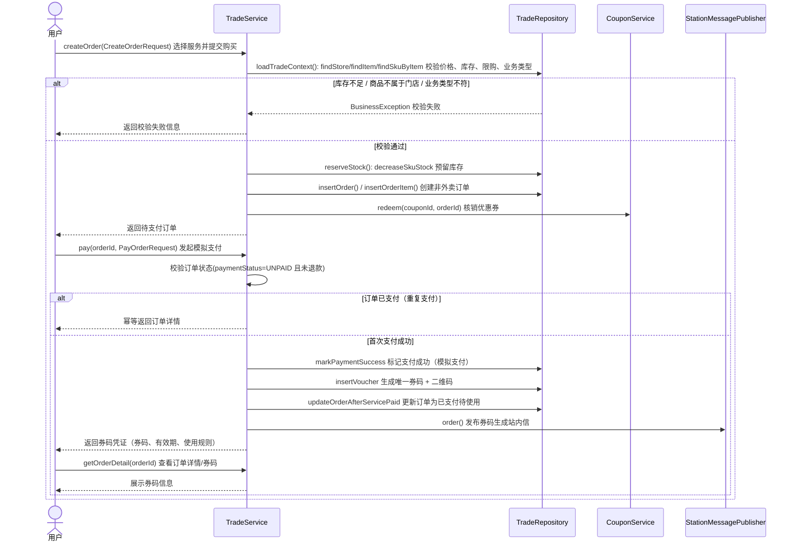
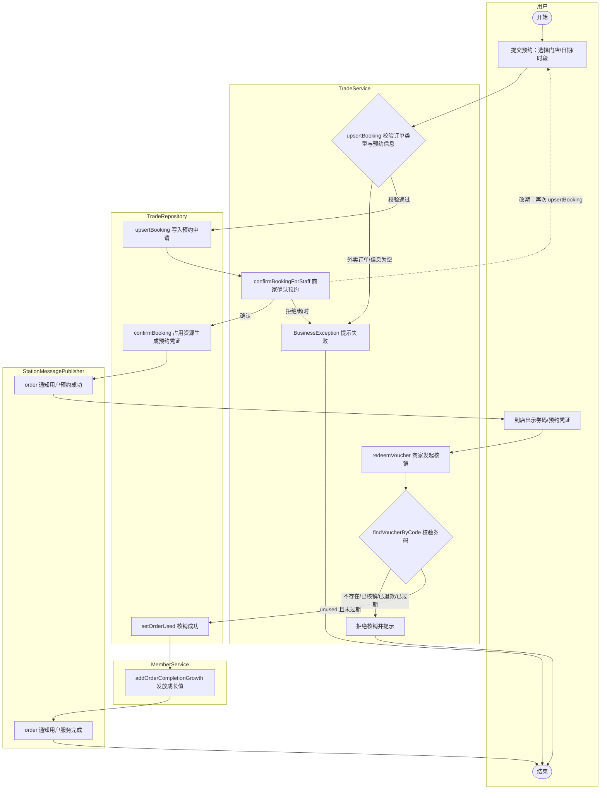
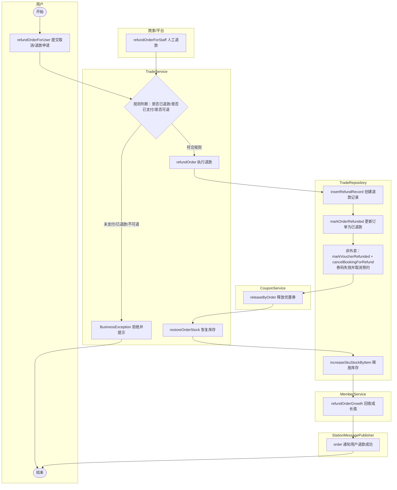
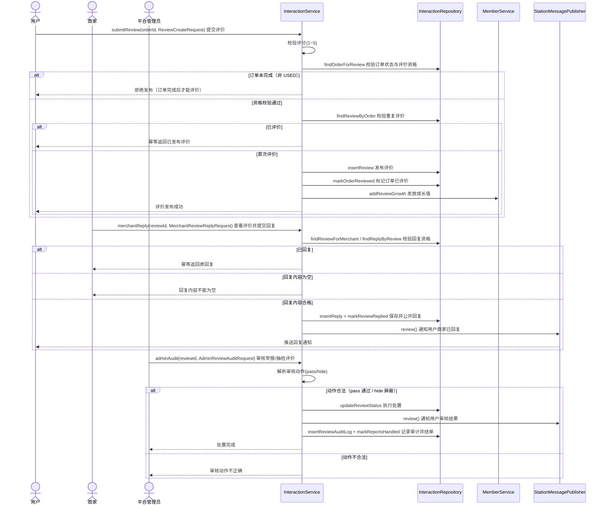

# 对象级图（四张）

> 根据项目实际代码生成，将组件级图中的抽象组件替换为真实类对象与方法。
> 项目说明：订单、支付（模拟）、券码、库存、退款集中在 `TradeService` + `TradeRepository`；评价/审核集中在 `InteractionService`；通知统一走 `StationMessagePublisher`。

## 组件 → 对象（真实类）映射

| 组件级图里的组件 | 项目中的真实对象 / 方法 |
| --- | --- |
| 订单服务 | `TradeService` |
| 库存服务 | `TradeService.loadTradeContext/reserveStock` → `TradeRepository.decreaseSkuStock` |
| 支付服务 / 支付模拟服务 | `TradeService.pay` → `TradeRepository.markPaymentSuccess`（同步模拟支付，无回调） |
| 券码服务 | `TradeService.pay/redeemVoucher` → `TradeRepository.insertVoucher/findVoucherByCode/setOrderUsed/markVoucherRefunded` |
| 优惠券 | `CouponService.redeem / releaseByOrder` |
| 会员成长值 | `MemberService.addOrderCompletionGrowth / refundOrderGrowth / addReviewGrowth` |
| 通知服务 | `StationMessagePublisher.order / review` |
| 评价服务 | `InteractionService.submitReview / merchantReply` |
| 审核服务 | `InteractionService.adminAudit` + `InteractionRepository.updateReviewStatus` |

---

## 图1：用户购买非外卖服务并获得券码凭证（对象级顺序图）

---

## 图2：用户预约到店/团购服务并由商家核销完成服务（对象级状态图）

---

## 图3：用户申请取消与退款，商家或平台处理退款（对象级状态图）

> 说明：组件级图里「商家审核 → 拒绝 → 平台复核」的多级审批，在真实代码中是**同步直接退款**（`refundOrder` 一次性完成，模拟退款 `MOCK-REFUND-xxx`），没有异步多级审批流，因此对象级图把两个入口（用户自助 / 商家平台人工）归并到同一个 `refundOrder`。

---

## 图4：用户完成订单后发布评价，商家回复，平台审核或治理评价（对象级顺序图）

