# 爱团软件详细设计说明书

[TOC]

# 1 引言

## 1.1 编写目的

本文档用于说明“爱团”本地生活服务平台的软件详细设计。文档围绕系统结构、子系统划分、功能模块、核心业务流程、数据结构、接口关系、界面组织、异常处理、安全控制、性能策略和测试计划展开，为开发、联调、测试和维护提供统一依据。

本文档主要面向开发人员、测试人员、维护人员和项目管理人员。开发人员可据此明确模块职责、接口边界和业务状态流转；测试人员可据此制定功能测试、集成测试和异常测试用例；维护人员可据此理解系统结构、数据关系和关键业务规则。

## 1.2 系统背景

爱团是一个综合本地生活服务平台，面向城市居民提供外卖订餐、到店团购、酒店民宿、休闲娱乐、电影演出、丽人医美、景点门票、按摩足疗等服务。系统通过用户端、商家端和平台后台三类入口，将用户消费、商家经营和平台治理连接为完整业务闭环。

系统建设目标如下：

1. 为用户提供商家搜索、分类浏览、商品服务查看、收藏、下单、支付、配送跟踪、券码核销、评价反馈、会员优惠和消息通知等功能。
2. 为商家提供入驻申请、门店资料维护、商品服务管理、订单处理、外卖履约、券码核销、认证材料提交、评价回复和经营数据查看等功能。
3. 为平台管理员提供商家审核、认证审核、用户治理、商品治理、订单治理、配送治理、公告运营、平台配置、权限控制和审计追踪等功能。
4. 在统一交易模型下区分外卖与非外卖业务，保证不同业务类型的页面展示、订单状态和履约规则互不混用。

## 1.3 运行角色

| 角色 | 说明 |
| --- | --- |
| 游客 | 未登录访问者，可浏览公开商家、商品服务和平台信息。 |
| 用户 | 注册并登录的消费者，可收藏、下单、支付、评价、管理地址和查看消息。 |
| 商家 | 入驻平台的经营主体，可维护门店、商品服务、订单和履约信息。 |
| 商家操作员 | 商家侧具体操作人员，可根据权限处理商品、订单、核销、评价等事务。 |
| 平台管理员 | 平台运营和治理人员，可管理用户、商家、商品、订单、公告、配置和审计日志。 |
| 系统服务 | 执行状态推进、消息生成、支付回调处理、统计汇总等内部任务的服务组件。 |

## 1.4 术语表

| 术语 | 含义 |
| --- | --- |
| 爱团 | 本地生活服务综合平台。 |
| 用户端 | 面向消费者的移动应用入口。 |
| 商家端 | 面向商家的经营管理入口。 |
| 平台后台 | 面向平台运营与治理人员的管理入口。 |
| 商家 | 在平台入驻并提供商品或服务的经营主体。 |
| 门店 | 商家在线下提供服务的具体经营地点。 |
| 外卖订单 | 用户购买餐品并由商家履约配送的订单。 |
| 非外卖订单 | 到店团购、酒店、娱乐、电影、丽人、景点、按摩等服务订单。 |
| 券码 | 非外卖服务支付后生成的到店核销凭证。 |
| 配送任务 | 外卖订单配送阶段对应的履约任务。 |
| 履约状态 | 订单从支付到完成期间的业务执行状态。 |
| 认证材料 | 商家提交的营业执照、许可证、身份证明等资质文件。 |
| 会员成长值 | 用户消费和活动行为产生的会员成长积分。 |
| 审计日志 | 记录关键管理动作和业务状态变化的日志。 |
| RBAC | 基于角色的访问控制模型。 |

## 1.5 设计原则

系统详细设计遵循以下原则：

1. **前后端分离**：用户端、商家端、平台后台通过统一接口与后端服务交互。
2. **业务域内聚**：账号、商家、商品、订单、配送、评价、营销、消息、后台治理等能力按领域组织。
3. **统一交易模型**：不同业务类型共享订单、支付、评价、消息等通用能力，差异化履约规则在各自子模块中处理。
4. **权限边界清晰**：用户、商家、管理员访问不同接口空间，商家只能操作自身经营数据。
5. **状态流转可追踪**：订单、配送、审核、核销等关键状态变化均保留记录。
6. **核心动作幂等**：下单、支付、接单、核销、审核等操作具备重复请求保护。
7. **扩展能力清晰**：支付渠道、配送服务、对象存储、智能推荐、复杂预约资源等能力通过适配层或领域子模块扩展。

---

# 2 系统总体结构设计

爱团系统采用前后端分离的多端架构，由用户端、商家端、平台后台、后端业务服务、数据库系统和文件资源服务组成。三类前端入口负责不同角色的交互体验，后端服务负责统一鉴权、业务编排、数据访问、状态流转、文件处理和日志审计。

系统核心业务链路为：

```text
用户发现服务 → 浏览商家与商品 → 下单支付 → 商家履约 → 配送或到店核销 → 订单完成 → 用户评价 → 平台治理
```

## 2.1 总体架构

图 2-19 系统总体架构图

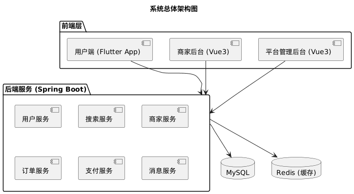

总体架构中，用户端、商家端和平台后台均通过 REST API 调用后端服务。后端服务统一处理身份认证、权限控制、业务规则、数据持久化、文件上传和审计日志。数据库保存平台核心业务数据，文件资源服务保存头像、门店图、商品图、评价图和资质材料等资源。

| 组成部分 | 主要职责 |
| --- | --- |
| 用户端 | 搜索浏览、下单支付、订单跟踪、收藏评价、地址管理、会员消息。 |
| 商家端 | 入驻申请、门店维护、商品服务管理、订单履约、券码核销、资质管理。 |
| 平台后台 | 用户治理、商家审核、商品治理、订单治理、配送治理、公告配置、审计追踪。 |
| 后端业务服务 | 认证授权、业务接口、状态流转、数据访问、文件处理、消息生成。 |
| 数据库系统 | 存储账号、用户、商家、门店、商品、订单、配送、评价、营销和配置数据。 |
| 文件资源服务 | 统一管理图片、证明材料和其他上传文件。 |

## 2.2 模块结构

图 2-20 系统模块结构图

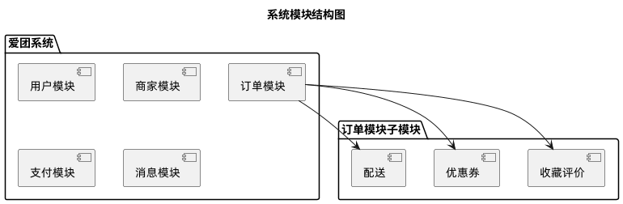

系统按业务域划分为以下模块：

1. 账号与权限模块：负责登录、注册、Token、角色和权限。
2. 用户资料模块：负责用户个人信息、头像、地址和会员资料。
3. 发现搜索模块：负责首页、模块页、搜索、筛选、排序和推荐。
4. 商家门店模块：负责商家主体、门店资料、营业信息和入驻审核。
5. 商品服务模块：负责商品、套餐、票券、房型、服务项目和分类。
6. 购物车模块：负责外卖商品加购、数量调整和金额预估。
7. 订单交易模块：负责下单、支付、取消、退款、订单详情和状态日志。
8. 配送履约模块：负责外卖接单、备餐、出餐、配送任务和配送轨迹。
9. 券码预约模块：负责非外卖券码、预约、核销和资源使用规则。
10. 收藏评价模块：负责收藏、取消收藏、评价、商家回复和举报处理。
11. 会员营销模块：负责优惠券、会员成长值、活动和权益。
12. 消息通知模块：负责站内消息、订单通知、审核通知和公告消息。
13. 文件资源模块：负责文件上传、访问、存储策略和资源归属。
14. 后台治理模块：负责平台管理、运营配置、审计日志和风险处理。
15. 智能服务模块：负责智能搜索、推荐解释、客服辅助和运营辅助。

## 2.3 数据关系概览

图 2-21 数据库 E-R 图

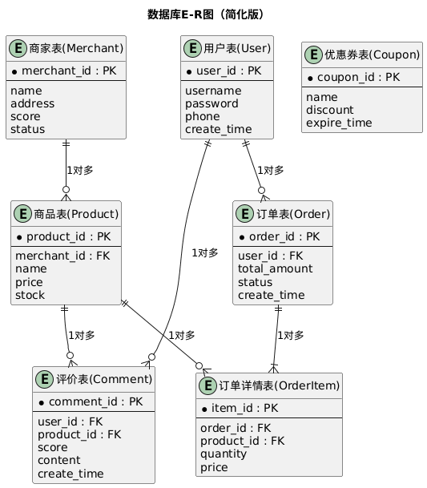

数据库实体围绕账号、用户、商家、门店、商品、订单和履约信息组织。账号与角色决定访问权限；用户资料、地址、收藏、会员信息支撑消费体验；商家、门店、商品和服务构成供给侧数据；订单、支付、配送、券码、评价构成交易闭环；公告、配置、审计、消息支撑平台治理。

主要实体关系包括：

- 一个用户账号对应一份用户资料，可拥有多个收货地址、收藏记录、订单和优惠券。
- 一个商家主体可拥有一个或多个门店，门店下挂商品或服务项目。
- 一个订单属于一个用户和一个门店，包含多条订单明细。
- 外卖订单关联配送任务和配送轨迹。
- 非外卖订单关联券码、预约或服务资源。
- 订单完成后可产生评价，评价可被商家回复或被平台治理。
- 管理员的关键操作写入审计日志。

---

# 3 子系统详细设计

## 3.1 用户管理子系统

图 2-1 用户管理活动图

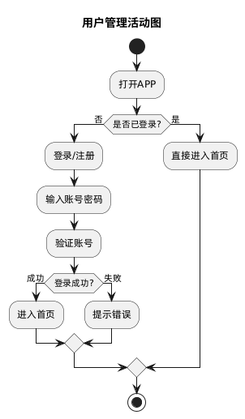

用户管理子系统负责用户注册、登录、身份校验、资料管理、地址管理和退出登录。用户通过账号密码、手机号或邮箱等方式登录，后端校验成功后签发访问令牌。用户端携带令牌访问需要登录的接口。

主要功能包括：

- 用户注册与登录。
- 用户资料查看与修改。
- 用户头像上传与展示。
- 收货地址新增、编辑、删除、设为默认。
- 登录状态保持与退出登录。
- 账号状态校验。

图 2-2 用户注册顺序图

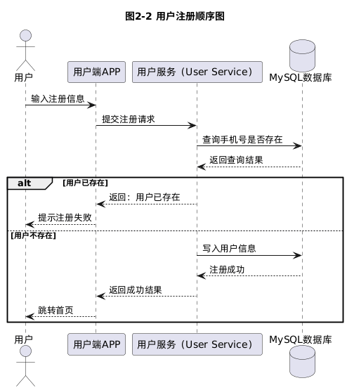

用户注册流程如下：

1. 用户填写注册信息。
2. 用户端进行基础格式校验。
3. 后端校验账号、手机号或邮箱是否重复。
4. 后端保存账号信息和用户资料。
5. 系统初始化用户会员资料。
6. 用户端展示注册结果。

图 2-3 用户登录顺序图

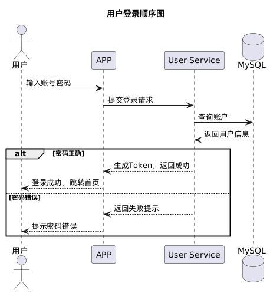

用户登录流程如下：

1. 用户提交登录名和密码。
2. 后端查询账号并校验账号状态。
3. 后端校验密码。
4. 校验通过后生成访问令牌。
5. 用户端保存令牌并拉取用户资料。
6. 登录失败时返回明确错误信息。

## 3.2 商家搜索与推荐子系统

图 2-4 商家搜索活动图

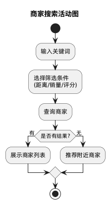

商家搜索与推荐子系统负责首页内容、业务分类、关键词搜索、筛选排序、热门推荐和个性化推荐。该子系统为用户发现服务提供入口。

搜索与推荐的数据来源包括：

- 门店基础信息。
- 商品和服务信息。
- 评分、销量、距离、价格和标签。
- 平台运营配置。
- 用户浏览、收藏、购买和评价行为。

搜索处理规则如下：

1. 用户输入关键词或选择业务分类。
2. 系统匹配商家名称、商品名称、服务名称、标签和简介。
3. 系统按业务类型、距离、评分、销量、价格等条件筛选。
4. 系统根据排序规则生成结果列表。
5. 用户端按商家卡片和商品服务卡片展示结果。

图 2-5 首页推荐顺序图

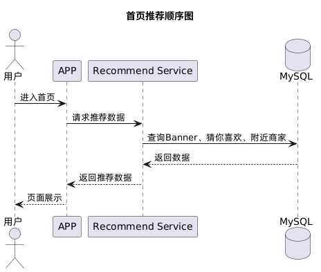

首页推荐流程如下：

1. 用户端请求首页聚合数据。
2. 后端读取 Banner、分类入口、公告、热门门店、热门商品和推荐内容。
3. 推荐服务结合运营权重和用户偏好生成排序结果。
4. 后端返回统一首页数据结构。
5. 用户端完成页面渲染。

## 3.3 商家详情与服务展示子系统

图 2-6 商家详情活动图

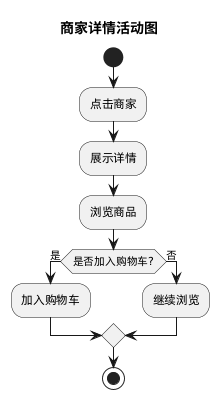

商家详情与服务展示子系统负责展示门店头图、商家信息、营业状态、地址、公告、评分、商品服务、评价和规则说明。系统根据业务类型选择不同展示结构和履约入口。

外卖商家详情页包含：

- 门店头图、名称、评分、销量和公告。
- 配送费、起送价、预计送达时间和配送范围。
- 商品分类、商品列表、加购按钮和购物车。
- 收藏门店、收藏商品和进入结算。

非外卖商家详情页包含：

- 商家基本信息、门店图、地址、营业时间。
- 服务项目、套餐、票券、房型或预约项目。
- 下单、评价、商家信息切换区域。
- 使用规则、退款规则、预约说明和到店提示。

图 2-7 查看商家详情顺序图

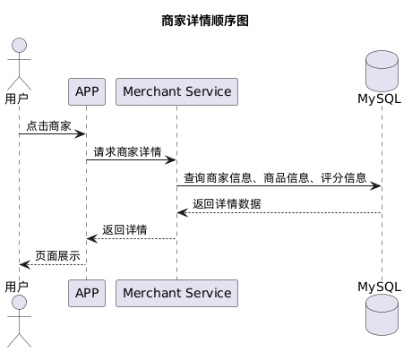

查看商家详情流程如下：

1. 用户端提交门店编号。
2. 后端查询门店、商家、商品服务、评价和业务规则。
3. 后端根据业务类型组装详情数据。
4. 用户端根据业务类型渲染外卖页或非外卖页。
5. 用户可继续执行收藏、加购、购买或查看评价等操作。

## 3.4 购物车与下单子系统

图 2-8 用户下单活动图

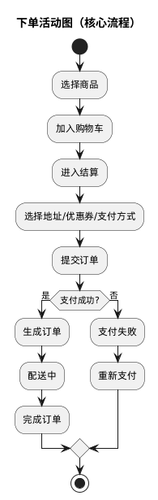

购物车与下单子系统负责外卖商品选择、数量调整、订单确认和订单提交。非外卖业务可从商品服务详情直接进入购买确认页。

外卖购物车规则如下：

- 同一购物车只包含同一门店商品。
- 商品下架、售罄或门店休息时不可加购。
- 商品数量变化后实时计算商品小计。
- 结算时必须选择有效收货地址。
- 后端在提交订单时重新校验价格、库存和可售状态。

图 2-9 提交订单顺序图

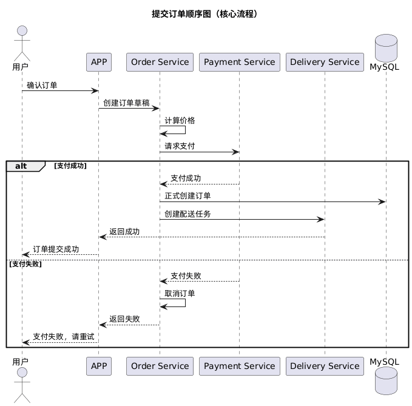

提交订单流程如下：

1. 用户选择商品服务、地址、优惠券和备注。
2. 用户端提交订单确认信息。
3. 后端校验商品服务状态、库存、价格和用户状态。
4. 后端计算订单金额并生成订单。
5. 系统记录订单明细和初始状态日志。
6. 用户端进入支付流程。

## 3.5 订单与配送子系统

图 2-10 订单管理活动图

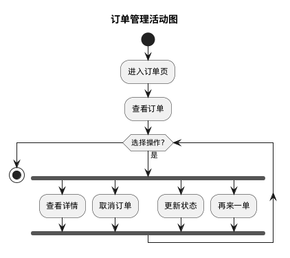

订单与配送子系统负责订单查询、订单详情、支付、取消、催单、外卖履约、非外卖核销和订单完成。订单模块以统一订单模型承载不同业务类型，并通过履约子模块处理差异逻辑。

外卖订单状态流转如下：

```text
待支付 → 待商家接单 → 已接单 → 备餐中 → 待配送 → 配送中 → 已送达 → 已完成
```

外卖订单异常状态包括：已取消、商家拒单、配送异常、平台标记异常。

非外卖订单状态流转如下：

```text
待支付 → 待使用 → 已使用 → 已完成
```

非外卖订单异常状态包括：已取消、已退款、券码过期、核销异常。

图 2-11 支付订单顺序图

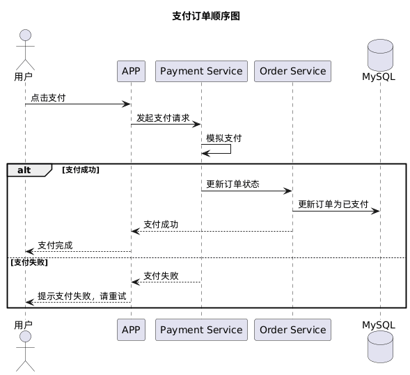

支付订单流程如下：

1. 用户选择支付方式。
2. 后端校验订单状态和应付金额。
3. 支付服务创建支付流水。
4. 支付渠道返回支付结果。
5. 后端根据支付结果更新支付记录和订单状态。
6. 外卖订单进入商家接单流程，非外卖订单生成券码或预约凭证。
7. 系统生成订单消息并通知相关角色。

图 2-12 配送流程顺序图

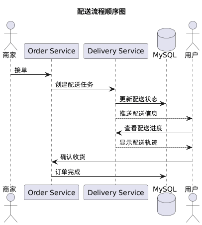

配送流程如下：

1. 外卖订单支付后进入待商家接单。
2. 商家接单后开始备餐。
3. 商家出餐后订单进入待配送。
4. 配送服务创建配送任务并记录配送节点。
5. 配送任务依次推进为取餐、配送中、到达、完成。
6. 用户端展示配送时间线和订单状态。
7. 配送异常时平台后台可介入处理。

## 3.6 优惠券与会员子系统

图 2-13 优惠券使用活动图

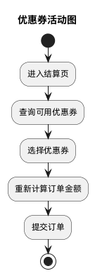

优惠券与会员子系统负责优惠券领取、用券校验、订单抵扣、会员成长值累计和权益展示。

优惠券规则包括：

- 优惠券具有有效期、门槛、适用业务类型、抵扣金额和使用状态。
- 结算时系统筛选可用优惠券，并说明不可用原因。
- 支付前后端重新校验优惠券状态，防止重复使用。
- 订单取消或退款时按优惠券规则处理券状态。

会员规则包括：

- 用户完成订单后获得会员成长值。
- 成长值决定会员等级。
- 会员等级关联配送优惠、专属券、活动权益和客服优先级。

## 3.7 收藏与评价子系统

图 2-14 收藏与评价活动图

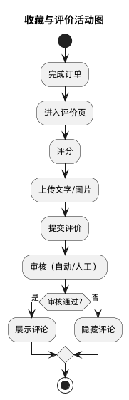

收藏与评价子系统负责用户收藏门店或商品服务、取消收藏、查看收藏列表、发布评价、查看评价、商家回复和平台治理。

收藏规则包括：

- 收藏对象分为门店和商品服务。
- 收藏操作需要登录。
- 同一用户对同一对象只能保留一条有效收藏。
- 收藏列表展示对象名称、图片、价格、商家信息和跳转入口。

评价规则包括：

- 用户完成订单后可发布评价。
- 评价包含评分、文字、图片和标签。
- 每个订单的同一评价入口只能发布一次有效评价。
- 商家可回复评价。
- 平台可处理违规评价和举报。

图 2-15 用户评价顺序图

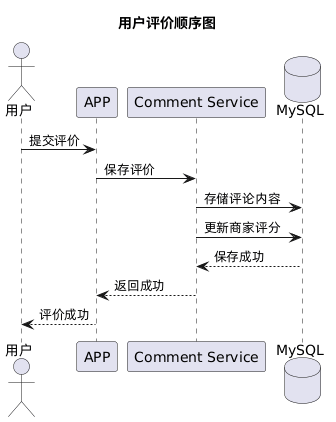

用户评价流程如下：

1. 用户进入可评价订单。
2. 用户填写评分、文字、图片和标签。
3. 后端校验订单归属、订单状态和重复评价。
4. 系统保存评价并更新商家评分。
5. 商家端可查看评价并回复。
6. 平台后台可进行评价治理。

## 3.8 消息通知子系统

图 2-16 消息通知活动图

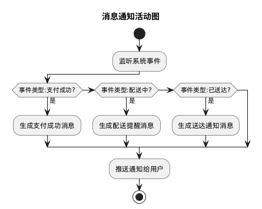

消息通知子系统负责订单消息、配送消息、审核消息、系统公告、营销消息和客服消息。消息由业务事件触发，也可由平台运营人员主动发布。

消息生成规则如下：

1. 业务动作完成后产生消息事件。
2. 消息服务根据事件类型选择模板。
3. 系统生成接收人、标题、内容、跳转目标和已读状态。
4. 接收端查询消息列表并更新已读状态。

消息类型包括用户订单消息、商家订单提醒、配送状态消息、入驻与认证审核消息、平台公告消息、优惠券和会员消息、客服会话消息。

## 3.9 商家后台管理子系统

图 2-17 商家后台活动图

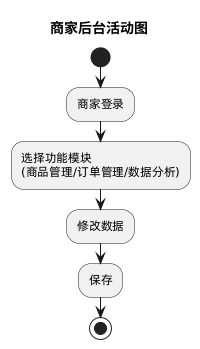

商家后台管理子系统面向商家经营人员，提供商家经营所需的管理能力。商家端根据登录账号确定可管理的商家和门店范围。

商家端主要能力包括：

- 商家登录与退出。
- 门店资料维护。
- 商品服务新增、编辑、上下架和分类管理。
- 商品、门店和资质图片上传。
- 外卖订单接单、拒单、备餐、出餐和配送推进。
- 非外卖订单券码核销和预约处理。
- 自动接单、手动接单和配送规则设置。
- 评价查看和回复。
- 资质材料提交和审核结果查看。
- 经营数据查看。

图 2-18 商家处理订单顺序图

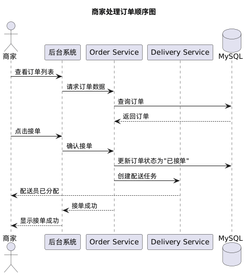

商家处理订单流程如下：

1. 商家端查询订单列表。
2. 系统根据业务类型和订单状态展示可用操作。
3. 外卖订单可执行接单、拒单、备餐、出餐、配送推进和完成。
4. 非外卖订单可执行券码核销或预约确认。
5. 每次操作均校验商家归属和订单状态。
6. 操作成功后写入订单状态日志并通知用户。

## 3.10 平台后台管理子系统

平台后台管理子系统面向平台管理员，负责全局治理和运营配置。

平台后台主要能力包括：

- 平台经营总览。
- 用户列表、用户状态和用户详情管理。
- 商家入驻申请审核。
- 商家主体、门店和账号治理。
- 商家认证材料审核。
- 商品服务审核、上下架和分类治理。
- 订单查询、订单详情、异常订单处理。
- 配送任务查看、人工推进和异常标记。
- 公告新增、编辑、发布和下线。
- 平台配置和业务字典维护。
- 管理员操作审计。

---

# 4 功能模块设计

## 4.1 账号与权限模块

**模块编号：M1**  
**模块名称：账号与权限模块**

### 输入

注册信息、登录凭据、角色授权信息、Token 校验请求。

### 处理

1. 校验登录名、密码、账号状态和角色。
2. 生成访问令牌。
3. 解析令牌并构建登录用户上下文。
4. 根据角色控制接口访问范围。
5. 对敏感管理动作记录审计日志。

### 输出

登录结果、访问令牌、本次登录账号角色、权限校验结果。

## 4.2 用户资料模块

**模块编号：M2**  
**模块名称：用户资料模块**

### 输入

用户资料表单、头像文件、地址表单、默认地址设置请求。

### 处理

1. 查询和更新用户资料。
2. 上传并关联头像资源。
3. 新增、编辑、删除用户地址。
4. 设置默认地址时取消其他默认标记。
5. 为结算页提供默认地址。

### 输出

用户资料、地址列表、默认地址、操作结果。

## 4.3 发现搜索模块

**模块编号：M3**  
**模块名称：发现搜索模块**

### 输入

首页请求、业务类型、搜索关键词、筛选条件、排序条件、分页参数。

### 处理

1. 聚合首页内容。
2. 按业务类型加载模块数据。
3. 根据关键词匹配商家和商品服务。
4. 按距离、评分、销量、价格和推荐权重排序。
5. 返回列表和空态信息。

### 输出

首页数据、模块页数据、搜索结果、推荐结果。

## 4.4 商家门店模块

**模块编号：M4**  
**模块名称：商家门店模块**

### 输入

商家入驻申请、商家资料、门店资料、认证材料、审核意见。

### 处理

1. 保存商家入驻申请。
2. 平台审核申请并建立商家主体。
3. 商家维护门店资料和营业信息。
4. 商家提交认证材料。
5. 平台审核认证材料。
6. 根据商家和门店状态控制商品展示和订单处理。

### 输出

商家资料、门店资料、入驻审核结果、认证审核结果。

## 4.5 商品服务模块

**模块编号：M5**  
**模块名称：商品服务模块**

### 输入

商品服务表单、分类信息、图片文件、上下架请求、库存和价格信息。

### 处理

1. 新增或编辑商品服务。
2. 维护分类和展示顺序。
3. 上传并关联封面图。
4. 控制上下架和售罄状态。
5. 根据业务类型提供不同字段和规则。

### 输出

商品服务列表、商品服务详情、分类列表、上下架结果。

## 4.6 购物车模块

**模块编号：M6**  
**模块名称：购物车模块**

### 输入

门店编号、商品编号、购买数量、规格信息。

### 处理

1. 校验商品是否可售。
2. 添加商品到购物车。
3. 修改商品数量。
4. 删除或清空购物车。
5. 计算商品小计和起送差额。

### 输出

购物车明细、商品数量、金额预估、结算可用状态。

## 4.7 订单支付模块

**模块编号：M7**  
**模块名称：订单支付模块**

### 输入

订单确认信息、商品服务明细、地址或使用人信息、优惠券、支付方式。

### 处理

1. 校验用户、门店、商品、库存和价格。
2. 计算订单金额。
3. 生成订单、明细和状态日志。
4. 创建支付流水。
5. 处理支付结果。
6. 根据业务类型进入外卖履约或券码核销流程。

### 输出

订单创建结果、支付结果、订单状态、订单详情。

## 4.8 配送履约模块

**模块编号：M8**  
**模块名称：配送履约模块**

### 输入

外卖订单、商家接单动作、商家备餐动作、配送推进动作、异常处理动作。

### 处理

1. 商家接单或拒单。
2. 商家开始备餐和出餐。
3. 创建配送任务。
4. 推进配送节点。
5. 处理配送异常。
6. 同步订单履约状态。

### 输出

履约状态、配送任务、配送时间线、异常处理结果。

## 4.9 券码预约模块

**模块编号：M9**  
**模块名称：券码预约模块**

### 输入

非外卖订单、使用人信息、预约时间、核销码、核销请求。

### 处理

1. 支付成功后生成券码或预约凭证。
2. 用户端展示券码和使用规则。
3. 商家端校验券码归属、状态和有效期。
4. 核销成功后更新订单状态。
5. 重复核销返回幂等结果。

### 输出

券码信息、预约信息、核销结果、订单状态。

## 4.10 收藏评价模块

**模块编号：M10**  
**模块名称：收藏评价模块**

### 输入

收藏对象类型和编号、评价内容、评价图片、商家回复、举报或治理请求。

### 处理

1. 新增或取消收藏。
2. 查询收藏列表。
3. 发布订单评价。
4. 更新商家评分。
5. 保存商家回复。
6. 处理评价举报。

### 输出

收藏状态、收藏列表、评价列表、评分摘要、治理结果。

## 4.11 会员营销模块

**模块编号：M11**  
**模块名称：会员营销模块**

### 输入

优惠券领取请求、订单结算信息、订单完成事件、会员权益配置。

### 处理

1. 校验优惠券领取资格。
2. 查询可用券和不可用原因。
3. 订单支付时使用优惠券。
4. 订单完成后累计成长值。
5. 计算会员等级和权益。

### 输出

用户券包、可用优惠券、会员等级、成长值和权益。

## 4.12 消息客服模块

**模块编号：M12**  
**模块名称：消息客服模块**

### 输入

订单状态事件、审核结果事件、公告发布请求、客服消息。

### 处理

1. 根据业务事件生成消息。
2. 保存接收人、内容、跳转目标和已读状态。
3. 查询消息列表和未读数量。
4. 处理客服会话消息。
5. 支持公告发布和下线。

### 输出

站内消息、未读数量、公告列表、客服会话记录。

## 4.13 平台治理模块

**模块编号：M13**  
**模块名称：平台治理模块**

### 输入

管理员操作请求、审核意见、查询筛选条件、配置表单。

### 处理

1. 查询平台总览指标。
2. 管理用户、商家、门店、商品和订单。
3. 审核入驻申请和认证材料。
4. 处理异常订单和配送任务。
5. 维护公告和配置。
6. 记录审计日志。

### 输出

管理列表、审核结果、配置结果、审计记录。

## 4.14 智能服务模块

**模块编号：M14**  
**模块名称：智能服务模块**

### 输入

搜索语句、用户偏好、商家经营数据、客服会话上下文、平台治理数据。

### 处理

1. 识别用户意图。
2. 调用对应智能能力。
3. 读取必要业务数据。
4. 生成推荐、解释、建议或回复草稿。
5. 记录调用日志。
6. 对关键业务动作只提供建议，不直接执行。

### 输出

搜索解释、推荐理由、客服回复建议、商家经营建议、平台治理建议。

---

# 5 数据结构设计

## 5.1 数据设计原则

系统数据结构遵循以下原则：

1. 账号认证数据与业务资料分离。
2. 用户、商家、管理员通过角色区分访问范围。
3. 门店、商品服务和订单均保留业务类型字段。
4. 外卖与非外卖共享订单主模型，履约差异通过关联实体体现。
5. 关键状态变化记录日志。
6. 文件资源通过统一文件实体管理。
7. 管理员操作保留审计信息。

## 5.2 核心数据实体

| 数据域 | 核心实体 | 说明 |
| --- | --- | --- |
| 账号权限 | 账号、角色、权限、账号角色关系 | 管理登录身份和访问权限。 |
| 用户 | 用户资料、收货地址、收藏、会员资料 | 管理消费者个人信息和消费辅助数据。 |
| 商家 | 商家主体、入驻申请、认证材料、审核日志 | 管理商家准入和资质。 |
| 门店 | 门店资料、营业信息、配送规则 | 管理商家具体经营地点。 |
| 商品服务 | 分类、商品、服务、套餐、票券、房型 | 管理平台供给内容。 |
| 购物车 | 购物车、购物车明细 | 管理外卖购买前的商品选择。 |
| 订单 | 订单主表、订单明细、订单状态日志 | 管理交易主流程。 |
| 支付 | 支付流水、退款记录 | 管理支付和资金状态。 |
| 配送 | 配送任务、配送轨迹节点 | 管理外卖履约过程。 |
| 券码预约 | 券码、预约、场次或资源日历 | 管理非外卖服务使用凭证。 |
| 评价 | 评价、评价图片、商家回复、举报 | 管理用户反馈和内容治理。 |
| 营销会员 | 优惠券模板、用户券、会员等级、权益 | 管理促销和会员体系。 |
| 消息客服 | 站内消息、公告、客服会话、客服消息 | 管理通知和沟通。 |
| 文件资源 | 文件资产、文件归属、访问地址 | 管理上传资源。 |
| 平台治理 | 配置、字典、审计日志、操作日志 | 管理平台运营和追踪。 |
| 智能服务 | 智能能力配置、调用日志 | 管理智能服务能力。 |

## 5.3 账号与权限数据

账号实体保存登录名、手机号、邮箱、密码摘要、账号类型、账号状态和创建时间。角色实体保存角色编码和名称。权限实体保存接口、菜单或按钮权限。账号角色关系用于为账号分配角色。

权限控制规则如下：

- 用户角色访问用户端业务接口。
- 商家角色访问商家端经营接口。
- 管理员角色访问平台后台治理接口。
- 商家数据操作必须校验商家归属。
- 管理员关键动作写入审计日志。

## 5.4 商家与商品数据

商家主体保存商家名称、联系人、联系电话、营业执照号、审核状态和账号归属。门店实体保存门店名称、地址、业务类型、营业状态、营业时间、公告、联系电话和封面图。

商品服务实体保存名称、业务类型、分类、价格、原价、库存、销量、状态、封面图、简介和规则说明。不同业务类型可扩展不同业务字段，例如外卖商品关注售罄和配送，酒店房型关注入住日期，电影演出关注场次和票档，景点门票关注日期票和入园规则。

## 5.5 订单与履约数据

订单主实体保存订单号、用户、门店、业务类型、订单状态、履约状态、支付状态、金额、优惠、地址、备注和创建时间。订单明细保存商品服务名称、单价、数量、封面图和规则快照。

外卖订单关联配送任务，配送任务保存取餐、配送中、送达等节点。非外卖订单关联券码或预约记录，券码保存码值、有效期、核销状态和核销时间。

订单状态日志保存每一次状态变化，包括变更前状态、变更后状态、操作人、操作类型、备注和时间。

## 5.6 文件资源数据

文件资源实体保存文件名、存储路径、访问地址、文件大小、文件类型、业务类型、上传人和上传时间。业务表只保存文件访问地址或文件编号，不直接处理底层存储细节。

文件业务类型包括：用户头像、门店封面、商品服务图片、评价图片、公告图片和商家认证材料。

---

# 6 接口与权限设计

## 6.1 接口分组

接口按调用方和业务边界分组。

| 接口分组 | 调用方 | 主要内容 |
| --- | --- | --- |
| 开放接口 | 游客、登录前用户、登录前商家 | 登录、注册、公开查询、入驻申请。 |
| 用户端接口 | 用户 | 用户资料、地址、收藏、首页搜索、下单、订单、评价、消息。 |
| 商家端接口 | 商家 | 商家资料、门店、商品服务、订单处理、履约、核销、认证材料。 |
| 平台后台接口 | 管理员 | 用户治理、商家治理、商品治理、订单治理、配送治理、公告配置、审计。 |
| 公共接口 | 三端 | 文件上传、文件访问、字典、公开配置。 |

## 6.2 统一响应格式

系统接口返回统一结构：

```json
{
  "code": 0,
  "message": "success",
  "data": {},
  "timestamp": "2026-05-24T12:00:00+08:00"
}
```

分页列表返回结构：

```json
{
  "list": [],
  "page": 1,
  "pageSize": 20,
  "total": 100,
  "hasNext": true
}
```

## 6.3 主要接口

### 6.3.1 开放接口

| 方法 | 路径 | 说明 |
| --- | --- | --- |
| POST | `/api/open/auth/user/login` | 用户登录。 |
| POST | `/api/open/auth/user/register` | 用户注册。 |
| POST | `/api/open/auth/merchant/login` | 商家登录。 |
| POST | `/api/open/auth/admin/login` | 管理员登录。 |
| POST | `/api/open/merchant/applications` | 商家提交入驻申请。 |

### 6.3.2 用户端接口

| 方法 | 路径 | 说明 |
| --- | --- | --- |
| GET | `/api/app/account/profile` | 查询用户资料。 |
| PUT | `/api/app/account/profile` | 修改用户资料。 |
| GET | `/api/app/account/addresses` | 查询地址列表。 |
| POST | `/api/app/account/addresses` | 新增地址。 |
| PUT | `/api/app/account/addresses/{id}` | 编辑地址。 |
| DELETE | `/api/app/account/addresses/{id}` | 删除地址。 |
| GET | `/api/app/account/favorites` | 查询收藏。 |
| POST | `/api/app/account/favorites` | 新增收藏。 |
| DELETE | `/api/app/account/favorites/{id}` | 取消收藏。 |
| GET | `/api/app/discovery/home` | 首页聚合数据。 |
| GET | `/api/app/discovery/modules/{code}` | 模块页数据。 |
| GET | `/api/app/discovery/stores/search` | 搜索商家和商品服务。 |
| GET | `/api/app/discovery/stores/{id}` | 查询商家详情。 |
| GET | `/api/app/discovery/items/{id}` | 查询商品服务详情。 |
| POST | `/api/app/trade/orders` | 创建订单。 |
| POST | `/api/app/trade/orders/{id}/pay` | 支付订单。 |
| GET | `/api/app/trade/orders` | 查询订单列表。 |
| GET | `/api/app/trade/orders/{id}` | 查询订单详情。 |
| POST | `/api/app/trade/orders/{id}/cancel` | 取消订单。 |
| POST | `/api/app/trade/orders/{id}/remind` | 催单。 |
| POST | `/api/app/reviews` | 发布评价。 |
| GET | `/api/app/messages` | 查询消息。 |

### 6.3.3 商家端接口

| 方法 | 路径 | 说明 |
| --- | --- | --- |
| GET | `/api/merchant/profile` | 查询登录商家资料。 |
| GET | `/api/merchant/stores` | 查询门店。 |
| PUT | `/api/merchant/stores/{id}` | 编辑门店。 |
| GET | `/api/merchant/catalog/items` | 查询商品服务。 |
| POST | `/api/merchant/catalog/items` | 新增商品服务。 |
| PUT | `/api/merchant/catalog/items/{id}` | 编辑商品服务。 |
| POST | `/api/merchant/catalog/items/{id}/status` | 调整上下架状态。 |
| GET | `/api/merchant/orders` | 查询订单。 |
| GET | `/api/merchant/orders/{id}` | 查询订单详情。 |
| POST | `/api/merchant/orders/{id}/accept` | 外卖接单。 |
| POST | `/api/merchant/orders/{id}/reject` | 外卖拒单。 |
| POST | `/api/merchant/orders/{id}/prepare` | 开始备餐。 |
| POST | `/api/merchant/orders/{id}/ready` | 出餐。 |
| POST | `/api/merchant/orders/{id}/delivery/advance` | 推进配送。 |
| POST | `/api/merchant/orders/vouchers/verify` | 券码核销。 |
| GET | `/api/merchant/certification` | 查询认证状态。 |
| POST | `/api/merchant/certification/materials` | 上传认证材料。 |

### 6.3.4 平台后台接口

| 方法 | 路径 | 说明 |
| --- | --- | --- |
| GET | `/api/admin/dashboard` | 查询平台总览。 |
| GET | `/api/admin/users` | 查询用户列表。 |
| POST | `/api/admin/users/{id}/status` | 调整用户状态。 |
| GET | `/api/admin/merchants` | 查询商户列表。 |
| POST | `/api/admin/merchants` | 新增商户。 |
| PUT | `/api/admin/merchants/{id}` | 编辑商户。 |
| POST | `/api/admin/merchants/{id}/status` | 调整商户状态。 |
| GET | `/api/admin/merchants/applications` | 查询入驻申请。 |
| POST | `/api/admin/merchants/applications/{id}/approve` | 通过入驻申请。 |
| POST | `/api/admin/merchants/applications/{id}/reject` | 驳回入驻申请。 |
| GET | `/api/admin/merchants/certification-materials` | 查询认证材料。 |
| POST | `/api/admin/merchants/certification-materials/{id}/status` | 审核认证材料。 |
| GET | `/api/admin/catalog/items` | 查询商品服务。 |
| POST | `/api/admin/catalog/items/{id}/status` | 调整商品服务状态。 |
| GET | `/api/admin/orders` | 查询订单。 |
| GET | `/api/admin/orders/{id}` | 查询订单详情。 |
| POST | `/api/admin/orders/{id}/delivery/advance` | 人工推进配送。 |
| POST | `/api/admin/orders/{id}/abnormal` | 标记异常。 |
| GET | `/api/admin/announcements` | 查询公告。 |
| POST | `/api/admin/announcements` | 新增公告。 |
| PUT | `/api/admin/announcements/{id}` | 编辑公告。 |
| GET | `/api/admin/settings` | 查询平台配置。 |
| PUT | `/api/admin/settings/{key}` | 修改平台配置。 |
| GET | `/api/admin/audit-logs` | 查询审计日志。 |

## 6.4 权限控制

权限控制规则如下：

1. 开放接口允许未登录访问，但涉及提交类操作仍需进行参数校验和频率控制。
2. 用户端接口要求用户角色。
3. 商家端接口要求商家角色，并校验商家数据归属。
4. 平台后台接口要求管理员角色。
5. 文件资源访问根据文件业务类型决定公开访问或鉴权访问。
6. 管理员关键操作需记录审计日志。

---

# 7 核心业务流程设计

## 7.1 用户消费流程

1. 用户进入首页。
2. 用户通过搜索、分类或推荐进入商家详情。
3. 用户浏览商品或服务。
4. 外卖商品加入购物车，非外卖服务进入购买确认。
5. 用户选择地址、使用人、优惠券和备注。
6. 用户提交订单。
7. 用户完成支付。
8. 系统根据业务类型进入配送履约或券码核销流程。
9. 订单完成后用户评价。

## 7.2 外卖履约流程

1. 用户提交外卖订单并支付。
2. 商家收到待接单订单。
3. 商家接单或拒单。
4. 接单后商家开始备餐。
5. 商家出餐后进入待配送。
6. 配送任务创建并推进。
7. 用户查看配送进度。
8. 订单送达并完成。
9. 用户发布评价。

## 7.3 非外卖核销流程

1. 用户购买团购、门票、服务或预约类项目。
2. 用户完成支付。
3. 系统生成券码或预约凭证。
4. 用户到店出示券码。
5. 商家校验券码状态、归属和有效期。
6. 商家核销券码。
7. 订单进入已使用或已完成状态。
8. 用户可发布评价。

## 7.4 商家入驻流程

1. 商家提交入驻申请。
2. 系统保存申请信息并生成申请编号。
3. 平台管理员查看待审核申请。
4. 管理员通过或驳回申请。
5. 审核通过后建立商家账号、商家主体和门店资料。
6. 商家登录商家端完善门店和商品服务信息。
7. 审核动作写入审计日志。

## 7.5 商家认证流程

1. 商家选择材料类型并上传资质文件。
2. 系统保存文件资源和认证材料记录。
3. 平台管理员查看材料内容。
4. 管理员通过或驳回材料。
5. 系统更新认证状态并通知商家。
6. 审核动作写入审计日志。

## 7.6 平台治理流程

1. 管理员登录平台后台。
2. 管理员按业务对象查询用户、商家、门店、商品、订单或配送任务。
3. 管理员执行审核、启停、上下架、异常标记、人工推进或配置修改。
4. 系统校验管理员权限和业务状态。
5. 系统保存治理结果。
6. 系统记录审计日志。
7. 相关用户或商家收到消息通知。

---

# 8 界面设计

## 8.1 总体界面原则

爱团界面设计遵循真实、清晰、高效、可信的原则。用户端突出本地生活消费体验，商家端和平台后台突出控制台操作效率。

界面设计要求如下：

- 页面结构清晰，信息层级明确。
- 状态文案使用中文业务语言，避免直接暴露内部状态码。
- 图片资源尽量展示真实内容，失败时使用统一占位。
- 表单提交、审核、上下架、核销等动作应有明确反馈。
- 列表页支持筛选、搜索、分页或刷新。
- 操作按钮根据业务状态显示，避免展示不可执行动作。
- 商家端和平台后台采用成熟管理系统风格。

## 8.2 用户端界面

| 页面 | 主要内容 |
| --- | --- |
| 登录注册页 | 登录、注册、验证码、协议提示。 |
| 首页 | 搜索、Banner、分类入口、热门推荐、附近商家。 |
| 搜索页 | 搜索框、历史搜索、筛选、排序、结果列表。 |
| 模块页 | 业务类型介绍、热门商品服务、商家列表。 |
| 外卖商家页 | 门店信息、配送规则、商品分类、购物车。 |
| 非外卖商家页 | 商家信息、服务项目、评价、使用规则。 |
| 商品服务详情页 | 图片、价格、规则、收藏、购买入口。 |
| 结算页 | 订单明细、地址、优惠券、备注、金额。 |
| 订单列表页 | 状态筛选、订单卡片、快捷操作。 |
| 订单详情页 | 商品明细、金额、履约状态、配送或券码信息。 |
| 地址管理页 | 地址列表、新增、编辑、删除、默认地址。 |
| 收藏页 | 收藏门店、收藏商品服务、跳转详情。 |
| 消息页 | 订单消息、公告、营销消息、审核消息。 |
| 我的页 | 用户资料、会员、优惠券、地址、订单入口。 |

## 8.3 商家端界面

| 页面 | 主要内容 |
| --- | --- |
| 登录页 | 商家登录、入驻申请。 |
| 工作台 | 订单概览、经营数据、待办事项。 |
| 订单中心 | 订单筛选、详情、接单、配送推进、券码核销。 |
| 商品服务管理 | 新增、编辑、上下架、分类、图片。 |
| 门店资料 | 门店名称、地址、营业时间、公告、封面。 |
| 履约设置 | 接单模式、配送规则、核销设置、预约设置。 |
| 认证材料 | 上传资质、查看审核状态。 |
| 评价管理 | 查看评价、回复评价。 |
| 经营看板 | 销售额、订单量、热销商品、评分趋势。 |

## 8.4 平台后台界面

| 页面 | 主要内容 |
| --- | --- |
| 平台总览 | 交易指标、订单指标、商家指标、异常提醒。 |
| 用户治理 | 用户搜索、状态调整、详情查看。 |
| 商家治理 | 入驻审核、商户编辑、门店治理。 |
| 认证审核 | 材料查看、通过、驳回、审核记录。 |
| 商品治理 | 商品服务筛选、上下架、分类治理。 |
| 订单治理 | 订单查询、详情、异常标记、人工推进。 |
| 配送治理 | 配送任务、轨迹节点、异常处理。 |
| 公告运营 | 公告新增、编辑、发布、下线。 |
| 平台配置 | 配置项、字典、业务开关。 |
| 审计日志 | 操作人、动作、对象、时间、详情。 |

---

# 9 异常处理、安全与性能设计

## 9.1 异常处理设计

| 异常类型 | 示例 | 处理方式 |
| --- | --- | --- |
| 输入异常 | 参数缺失、格式错误、数量非法 | 返回字段级错误提示。 |
| 认证异常 | 未登录、令牌过期、密码错误 | 返回登录失败或重新登录提示。 |
| 权限异常 | 越权访问订单或商家数据 | 拒绝访问并记录必要日志。 |
| 业务异常 | 商品下架、库存不足、状态不可操作 | 返回明确业务提示。 |
| 文件异常 | 文件过大、格式不支持、上传失败 | 返回上传失败并允许重试。 |
| 数据异常 | 数据不存在、重复提交 | 返回资源不存在或幂等结果。 |
| 系统异常 | 服务不可用、数据库异常 | 返回通用错误并记录日志。 |

前端处理规则：

- 表单错误在表单附近展示。
- 列表错误展示空态和重试入口。
- 关键动作失败不改变本地状态。
- 登录失效引导用户重新登录。
- 上传失败保留原内容并允许重新上传。

后端处理规则：

- 使用统一异常响应。
- 业务错误返回明确错误码和提示。
- 系统错误隐藏内部堆栈。
- 关键状态变更使用事务。
- 非法状态流转直接拒绝。

## 9.2 安全设计

账号安全：

- 密码使用安全摘要保存。
- 登录失败进行必要限制。
- 访问令牌设置有效期。
- 退出登录清理客户端登录状态。

接口安全：

- 用户、商家、管理员访问不同接口空间。
- 商家端接口校验商家归属。
- 后台接口校验管理员权限。
- 管理动作记录审计日志。

数据安全：

- 用户地址、手机号、邮箱等敏感信息按最小必要原则展示。
- 商家只能查看与自身订单相关的用户配送信息。
- 订单金额以后端计算为准。
- 支付、核销、审核等动作校验状态和权限。

文件安全：

- 上传文件限制大小和类型。
- 文件资源记录业务归属。
- 资质材料等敏感资源按权限访问。
- 文件访问地址不包含敏感凭据。

## 9.3 性能设计

1. 列表接口采用分页查询。
2. 首页、商家详情、订单详情使用聚合接口减少请求次数。
3. 图片资源使用懒加载和缩略图策略。
4. 对账号、订单号、用户编号、商家编号、门店编号、状态、业务类型和创建时间建立索引。
5. 对公告、字典、配置、分类等低频变化数据使用缓存策略。
6. 消息通知、统计汇总和智能服务调用采用异步处理策略。
7. 搜索排序支持按业务指标优化查询。
8. 高并发库存和支付场景使用事务、幂等键和状态校验保护一致性。

---

# 10 测试计划

## 10.1 测试目标

测试目标是验证系统功能正确性、流程完整性、权限安全性、异常可恢复性和多端数据一致性。重点覆盖用户消费闭环、商家履约闭环和平台治理闭环。

## 10.2 测试类型

| 序号 | 测试类型 | 测试模块 | 测试内容 |
| --- | --- | --- | --- |
| 1 | 单元测试 | 账号权限 | 注册、登录、令牌校验、角色校验。 |
| 2 | 单元测试 | 用户资料 | 资料修改、头像上传、地址管理。 |
| 3 | 单元测试 | 首页搜索 | 首页聚合、搜索、筛选、排序、推荐。 |
| 4 | 单元测试 | 商家详情 | 外卖详情、非外卖详情、商品服务详情。 |
| 5 | 单元测试 | 购物车 | 加购、减购、清空、金额计算。 |
| 6 | 单元测试 | 订单支付 | 下单、支付、取消、催单、订单详情。 |
| 7 | 单元测试 | 配送履约 | 接单、备餐、出餐、配送推进、异常处理。 |
| 8 | 单元测试 | 券码预约 | 出券、核销、重复核销、过期校验。 |
| 9 | 单元测试 | 收藏评价 | 收藏、取消收藏、评价、回复。 |
| 10 | 单元测试 | 会员营销 | 领券、用券、成长值、权益展示。 |
| 11 | 单元测试 | 商家端 | 商品服务管理、订单处理、门店资料、认证材料。 |
| 12 | 单元测试 | 平台后台 | 用户治理、商家审核、商品治理、订单治理、公告配置。 |
| 13 | 集成测试 | 用户与商家 | 用户下单后商家接单，订单状态同步。 |
| 14 | 集成测试 | 商家与后台 | 商家提交资质后后台审核，商家端状态同步。 |
| 15 | 集成测试 | 用户与后台 | 后台处理异常订单后用户端状态同步。 |
| 16 | 权限测试 | 全系统 | 用户、商家、管理员访问边界。 |
| 17 | 异常测试 | 全系统 | 参数错误、网络异常、非法状态、重复提交。 |
| 18 | 性能测试 | 列表与搜索 | 分页查询、搜索响应、图片加载。 |

## 10.3 关键验收场景

1. 用户可以注册、登录、修改资料和管理地址。
2. 用户可以浏览首页、搜索商家、进入模块页和商家详情页。
3. 用户可以收藏门店或商品服务，并在收藏列表查看。
4. 用户可以提交外卖订单并完成支付。
5. 商家可以接收外卖订单并推进履约状态。
6. 用户可以查看外卖配送时间线。
7. 用户可以购买非外卖服务并获得券码。
8. 商家可以核销非外卖券码。
9. 用户可以在订单完成后发布评价。
10. 商家可以回复评价。
11. 商家可以提交入驻申请和认证材料。
12. 平台管理员可以审核入驻申请和认证材料。
13. 平台管理员可以治理用户、商家、商品、订单和公告。
14. 非法访问、重复提交、非法状态流转均能被系统拦截。

## 10.4 测试通过标准

- 核心业务流程能够完整闭环。
- 三端展示的订单和履约状态保持一致。
- 用户、商家、管理员权限边界正确。
- 关键异常场景有明确提示和恢复方式。
- 订单、支付、配送、核销、审核等关键动作保留状态记录。
- 页面主要入口、表单和操作按钮符合设计逻辑。
- 主要列表、搜索和详情页面响应稳定。
