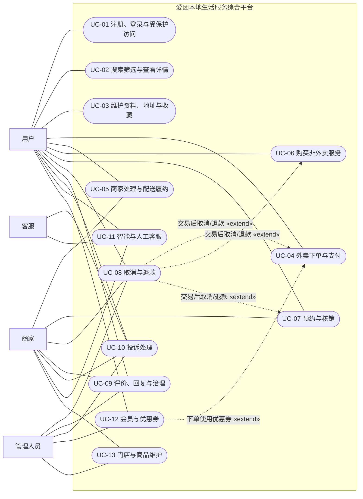
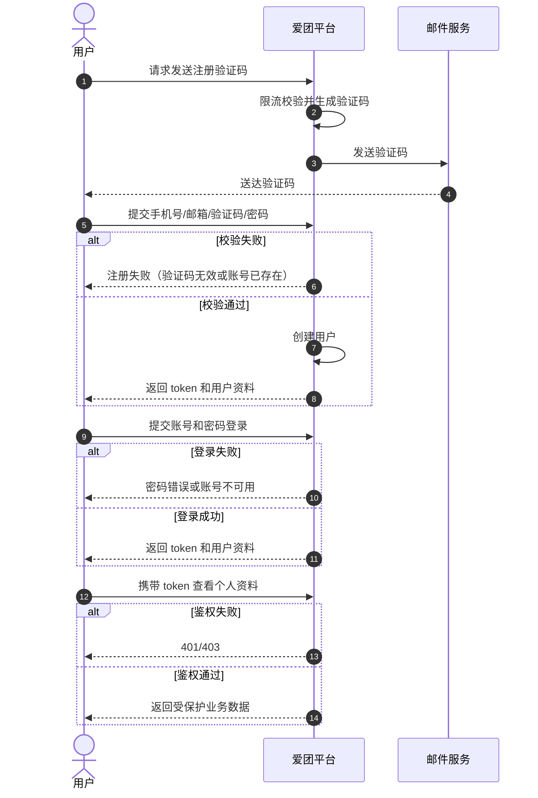
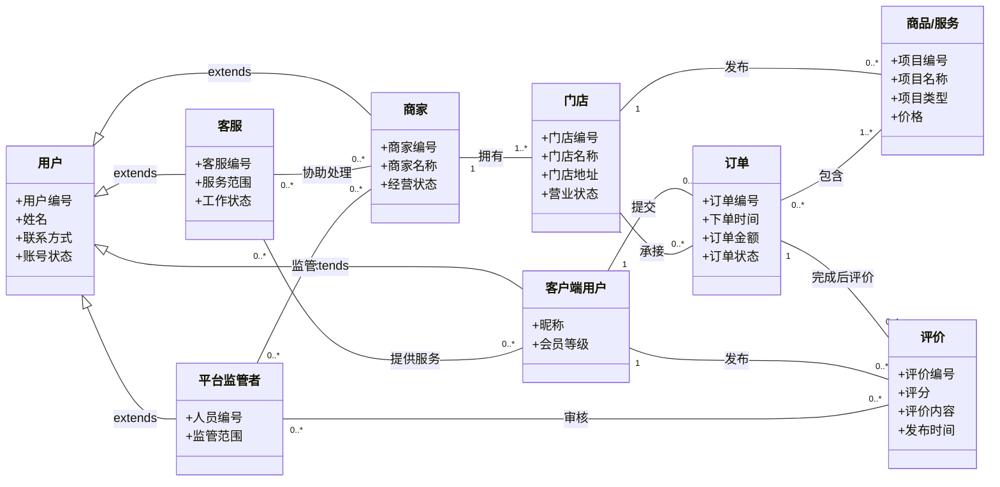

# 爱团本地生活服务综合平台软件需求规格说明书

## 1 范围

### 1.1 标识

| 项目 | 内容 |
| --- | --- |
| 项目名称 | 爱团本地生活服务综合平台 |
| 文档名称 | 软件需求规格说明书 |
| 文档编号 | AITUAN-SRS-2026-01 |
| 版本 | V1.2 |

### 1.2 系统概述

爱团本地生活服务综合平台面向本地生活消费场景建设，业务范围覆盖外卖订餐、到店团购、酒店民宿、休闲娱乐、电影演出、丽人医美、景点门票、足疗按摩等服务类型，并支持在线下单、支付模拟、履约跟踪、会员优惠、评价投诉、客服沟通、商家经营和平台售后治理等活动。

系统遵循移动消费优先原则，以 Android、iOS 用户端作为主要消费入口，以商家端和平台管理后台作为经营、售后与治理入口，以后端服务系统作为统一业务支撑中心，以配送模拟服务作为外卖履约支撑模块，以 AI 客服作为客服会话的可降级辅助能力。

系统建设目标是形成用户消费闭环、商家经营闭环和平台治理闭环，重点保障商家信息准确性、配送时效展示稳定性、预约履约可靠性和用户评价真实性。系统整体产品形态和业务组织方式参考美团、饿了么、淘宝闪购、大众点评等本地生活平台。

### 1.3 文档概述

本文档用于规定爱团本地生活服务综合平台的软件需求，作为后续系统设计、详细设计、编码实现、测试验证、部署交付和版本验收的依据。

本文档内容包括系统范围、引用文件、用户故事与功能需求编号、业务场景基线、系统用例模型、逐用例说明、概念类模型、逐用例系统级行为模型、能力需求、接口需求、数据需求、非功能需求、优先级、合格性规定、需求可追踪性、尚未解决的问题和附录说明。

### 1.4 基线

本项目当前需求基线如下：

1. 用户端以 Android、iOS 为优先实现终端。
2. 商家端和平台管理后台采用 Web 形态实现。
3. 后端采用 Spring Boot 技术体系，关系型数据库采用 MySQL。
4. 核心功能应满足可演示、可测试、可追踪要求。

## 2 引用文件

| 编号 | 文件或资料 | 说明 |
| --- | --- | --- |
| R1 | 2组-软件开发计划书.pdf | 项目范围、分工原则、交付边界和优先级依据 |
| R2 | 需求设计说明书.docx | 早期需求草稿与业务功能参考 |
| R3 | 软件需求规格说明书.pdf | 文档结构参考模板 |
| R4 | https://www.meituan.com/ | 本地生活综合服务平台参考 |
| R5 | https://www.ele.me/ | 外卖点餐与即时配送形态参考 |
| R6 | https://www.dianping.com/ | 商家评价与消费决策参考 |
| R7 | Spring Boot、MySQL、Flutter、Vue 官方文档 | 技术实现与运行环境参考 |
| R8 | 软件工程基础实践-2026夏.pdf | 业务场景定义、需求与三层模型要求、测试和追溯要求 |

## 3 需求

### 3.1 所需的状态和方式

爱团本地生活服务综合平台在当前阶段应支持以下状态和运行方式：

1. 软件应支持开发调试、联调测试、集成测试、演示试运行和正式运行等基本状态。
2. 用户端应以移动端方式提供访问，满足高频、碎片化的本地生活消费场景。
3. 商家端应以 Web 方式提供访问，满足门店经营、商品维护、订单处理和数据查看等操作需求。
4. 平台管理后台应以 Web 方式提供访问，满足退款复核、评价治理、投诉处理、平台客服和异常业务干预需求。
5. 后端服务系统应统一承载核心业务处理、状态流转、接口服务、数据存储和日志审计能力。
6. 支付环节应采用模拟支付方式，仅负责推动业务状态和记录支付结果，不承载真实资金流转和清结算处理。
7. 配送环节应采用后端模拟配送方式，通过规则、定时任务和后台触发推进状态流转，不设置独立骑手应用。
8. AI 客服应作为客服会话的增强能力接入，在不改变交易和售后规则的前提下提供基础答复，并在不可用时转人工或返回模板答复。

### 3.2 需求概述

#### 3.2.1 目标

本系统的建设目标如下：

1. 建设统一的本地生活综合服务平台，形成覆盖吃、喝、玩、乐、购、服务的基本业务闭环。
2. 支撑用户消费闭环、商家经营闭环和平台治理闭环，建立多角色统一承载能力。
3. 支持外卖到餐、到店团购、酒店民宿、休闲娱乐、电影演出、丽人医美、景点门票、上门按摩和会员体系等业务方向的扩展。
4. 优先完成 P0 核心能力，使系统具备可演示、可测试、可追踪的交付特性。
5. 在满足当前版本交付目标的前提下，为后续接入真实支付、真实配送和更多终端预留扩展空间。

#### 3.2.2 运行环境

1. 用户端运行于 Android、iOS 智能移动终端环境。
2. 商家端和平台管理后台运行于主流桌面浏览器环境。
3. 后端服务系统基于 Spring Boot 技术体系构建，并通过标准网络接口向前端提供服务。
4. 业务核心数据存储于 MySQL 关系型数据库。
5. 配送模拟服务与后端服务系统协同运行，通过统一业务数据和状态机制完成外卖履约仿真。
6. AI 客服依附于客服会话运行，仅使用完成答复所需的业务上下文，不独立执行交易或售后操作。

#### 3.2.3 用户的特点

1. 普通用户以移动端使用为主，操作时间碎片化，对搜索效率、下单流程顺畅性、订单状态可见性和评价反馈及时性要求较高。
2. 商家用户以门店经营人员和运营人员为主，主要通过 Web 端维护门店资料、商品或服务信息、处理订单和查看经营数据。
3. 平台管理员和平台客服主要通过 Web 后台进行退款复核、评价治理、投诉处理、客服回复、异常干预和审计查看，重视规则一致性和处理过程可追踪性。
4. AI 客服面向普通用户提供基础答复；低置信度或异常情况应转接商家客服或平台客服。

#### 3.2.4 关键点

本系统需求的关键点如下：

1. 建立完整的用户消费闭环，包括浏览、搜索、下单、支付模拟、履约查看和评价互动。
2. 建立商家经营闭环，包括门店与履约规则维护、商品或服务目录管理、订单处理、预约核销、退款处理、评价回复和客服沟通。
3. 建立平台治理闭环，包括退款复核、评价审核、投诉处理、平台客服、异常业务干预和日志审计。
4. 外卖类订单应具备清晰、稳定、可追踪的配送模拟状态流转能力。
5. 到店和预约类服务应具备券码、场次、日期、预约时段、核销和退款等差异化规则。
6. 评价系统应保证评价与真实已完成订单的关联关系，支持平台治理和商家回复。
7. AI 客服应支持基础问答、人工转接、内容安全检查、调用记录和异常降级，不得直接执行交易确认或售后处置。

#### 3.2.5 约束条件

1. 用户侧以 Android、iOS 为优先建设对象，当前阶段不以桌面消费端为重点。
2. 商家端与平台管理后台采用 Web 形态建设。
3. 后端服务系统采用 Spring Boot 技术体系，核心关系型数据存储采用 MySQL。
4. 支付环节仅采用模拟支付机制，不涉及真实支付通道接入、真实分账和真实财务清结算。
5. 履约环节采用后端模拟配送机制，不建设独立骑手应用和运力调度系统。
6. 当前版本以 P0 核心功能为优先交付范围，增强能力和扩展能力按优先级增量实现。
7. 外部地图、消息、AI 等服务可根据实际条件接入，外部服务不可用时应支持本地模拟或规则降级。

### 3.3 需求规格

#### 3.3.1 软件系统总体功能/对象结构

爱团本地生活服务综合平台的软件总体结构由用户端、商家端、平台管理后台、后端服务系统、配送模拟服务、AI 客服能力六个部分构成，各部分通过统一业务对象和统一状态机制形成协同关系。

系统总体结构如下：

```text
爱团本地生活服务综合平台
├─ 用户端
│  ├─ Android APP
│  └─ iOS APP
├─ 商家端
│  └─ 商家 Web 管理端
├─ 平台管理后台
│  └─ 平台 Web 管理后台
├─ 后端服务系统
│  ├─ 用户服务
│  ├─ 商家服务
│  ├─ 商品与服务服务
│  ├─ 订单服务
│  ├─ 支付模拟服务
│  ├─ 配送模拟服务
│  ├─ 评价与客服服务
│  ├─ 会员与优惠券服务
│  └─ 权限与日志服务
└─ AI 客服能力
   ├─ 问题理解与基础答复
   ├─ 人工客服转接
   ├─ 内容安全与降级
   └─ 调用记录
```

系统围绕以下核心业务对象组织：用户、用户资料、地址、收藏、会员账户、优惠券、商家、门店、履约规则、商品与服务、订单、预约、支付记录、券码凭证、评价、投诉工单、客服会话、配送任务、消息通知和 AI 调用记录。

#### 3.3.2 软件子系统功能/对象结构

1. 用户端  
   用户端是面向消费者的移动应用子系统，负责承载首页浏览、搜索与筛选、商家详情、购物车、结算、下单、支付模拟、订单查看、配送进度查看、评价互动、会员与个人中心等场景。其主要对象包括用户账户、地址、收藏、优惠券、会员信息、商品或服务、订单、评价和消息。

2. 商家端  
   商家端是面向商家经营人员的 Web 子系统，负责承载门店资料与履约规则维护、商品或服务目录及上下架管理、外卖订单处理、预约核销、退款处理、评价回复和用户咨询等场景。其主要对象包括商家主体、门店信息、履约规则、商品与服务目录、库存或可预约资源、订单、券码凭证、预约、退款申请、评价回复和客服会话。

3. 平台管理后台  
   平台管理后台是面向平台治理和客服人员的 Web 子系统，负责承载退款复核、评价审核、投诉处理、平台客服、异常订单与配送干预和日志审计等场景。其主要对象包括平台角色权限、退款申请、评价审核记录、投诉工单、客服会话、异常订单和审计记录。

4. 后端服务系统  
   后端服务系统是平台统一业务支撑子系统，负责维护核心业务对象、统一状态流转、接口服务、数据存储和日志能力。其主要对象包括用户、会员与优惠券、商家、门店、履约规则、商品与服务、订单、预约、支付记录、券码凭证、评价、投诉、客服会话和配送任务。

5. 配送模拟服务  
   配送模拟服务是面向外卖履约表达的支撑子系统，负责在后端内部完成配送任务生成、配送状态推进、预计送达时间计算和配送过程仿真。该子系统不面向独立骑手应用提供业务边界。

6. AI 客服能力  
   AI 客服能力依附于客服会话运行，负责问题理解、基础答复、内容安全检查和人工转接。该能力不得独立执行交易、退款、核销、投诉结案或权限变更；外部 AI 不可用时应降级为模板答复或人工客服。

### 3.4 用户故事与功能需求编号

本说明书采用“用户故事—功能需求—业务用例—系统级模型—验收项—测试用例”的统一编号方式。功能需求编号用于表达系统必须提供的业务能力，业务用例编号用于表达参与者为达成明确业务目标而完成的端到端流程。

| 用户故事编号 | 功能需求编号 | 用户故事 | 关联用例 | 
| --- | --- | --- | --- | 
| US-01 | REQ-F-001 | 作为用户，我希望注册、登录并进入受保护业务，以便安全使用本人有权访问的功能。 | UC-01 | 
| US-02 | REQ-F-002 | 作为用户，我希望搜索和筛选商家或商品并查看详情，以便选择符合条件的服务。 | UC-02 | 
| US-03 | REQ-F-003 | 作为用户，我希望维护个人资料、地址和收藏，以便保存个人信息和常用消费数据。 | UC-03 | 
| US-04 | REQ-F-004 | 作为用户，我希望完成外卖点单、优惠结算和模拟支付并查看订单详情，以便获得明确的交易结果。 | UC-04 | 
| US-05 | REQ-F-005 | 作为用户，我希望商家处理订单并推进配送履约，同时接收状态消息，以便掌握外卖订单进度。 | UC-05 | 
| US-06 | REQ-F-006 | 作为用户，我希望购买非外卖服务并获得券码凭证，以便后续到店使用。 | UC-06 | 
| US-07 | REQ-F-007 | 作为用户，我希望预约到店或团购服务并由商家核销，以便完成预约服务履约。 | UC-07 | 
| US-08 | REQ-F-008 | 作为用户，我希望申请取消与退款并获得商家或平台处理结果，以便完成逆向交易。 | UC-08 | 
| US-09 | REQ-F-009 | 作为已完成订单的用户，我希望发布评价并获得商家回复，同时由平台治理违规评价。 | UC-09 | P1 |
| US-10 | REQ-F-010 | 作为用户，我希望提交投诉并获得商家或平台的受理、处理和关闭结果。 | UC-10 | P1 |
| US-11 | REQ-F-011 | 作为用户，我希望联系客服并获得 AI、商家或平台客服回复，以便解决咨询或订单问题。 | UC-11 | P1 |
| US-12 | REQ-F-012 | 作为用户，我希望查看会员成长值、领取优惠券并在下单时使用，以便获得会员和优惠权益。 | UC-12 | P1 |
| US-13 | REQ-F-013 | 作为商家，我希望维护门店资料、履约规则和商品或服务目录，并管理上下架状态，以便持续经营。 | UC-13 | 

十三个用例均纳入本期业务场景基线。纳入用例的需求、模型、代码、自动化测试和追溯要求。

### 3.5 系统用例图



**图 3-1 爱团本地生活服务综合平台系统用例图**

### 3.6 业务用例说明与系统级模型

本节以爱团平台 CSCI 为需求边界，将业务目标、外部可见行为和系统必须承担的能力约束统一落实到各业务用例中。每个用例除描述参与者和业务流程外，还明确身份权限、一致性、幂等性、异常恢复、降级、安全和审计等可设计、可实现、可验证的系统责任，不再另设重复的 CSCI 能力需求章节。

#### 3.6.1 UC-01 用户注册、登录并进入受保护业务

- **参与者**：用户；验证码服务。
- **触发条件**：用户发起注册、登录，或访问需要认证的业务功能。
- **前置条件**：客户端可访问认证入口；注册账号尚未被占用。
- **主成功流程**：用户提交注册信息并完成验证码校验；系统创建有效账户；用户提交登录凭据；系统校验账户状态并签发登录态；用户访问订单、个人中心等受保护业务；系统校验登录态后允许访问。
- **备选或异常流程**：账号重复、验证码失效、密码错误或账号禁用时拒绝注册或登录；登录态失效或用户无权访问目标资源时拒绝访问并要求重新认证。
- **可验证结果**：成功时用户获得有效登录态并进入受保护业务；失败时不泄露受保护数据并记录必要安全日志。
- **系统能力约束**：登录态应支持过期和主动失效；受保护请求应校验身份、角色和资源归属；认证失败不得泄露敏感账号信息，关键安全事件应留痕。
- **关联项**：REQ-F-001、SYS-SEQ-01、ACC-01、E2E-TC-01。



**图 3-2 SYS-SEQ-01 用户注册、登录与受保护业务访问系统级顺序图**

#### 3.6.2 UC-02 用户搜索筛选商家/商品并查看详情

- **参与者**：用户；地图与位置服务。
- **触发条件**：用户进入首页、分类页，输入关键词或设置筛选条件。
- **前置条件**：平台存在已上架且可展示的商家或服务数据。
- **主成功流程**：用户输入关键词或选择分类；系统获取位置或用户手选区域；用户设置距离、评分、销量、价格或营业状态等条件；系统执行搜索、筛选、排序和分页；用户选择商家或商品；系统展示商家资料、商品价格、库存、营业状态和适用规则。
- **备选或异常流程**：定位失败时允许手选位置或降级为非距离排序；无匹配结果时返回空列表和重置建议；详情对象已下架或不可用时展示真实状态并限制交易入口。
- **可验证结果**：用户获得符合条件且字段完整的结果详情，或得到可解释的空结果和降级内容。
- **系统能力约束**：搜索结果应支持分页和稳定排序；定位不可用时应允许手选位置或采用非距离排序；下架、停业、售罄和不可预约状态必须真实展示并限制交易。
- **关联项**：REQ-F-002、SYS-SEQ-02、ACC-02、E2E-TC-02。

> **图 3-3 占位：SYS-SEQ-02 商家/商品搜索筛选与详情查看系统级顺序图。** 参与生命线包括用户、爱团平台系统和地图与位置服务；消息应覆盖提交关键词和筛选条件、获取或降级处理位置、返回分页结果、选择结果和查看详情，并使用 `alt` 表示定位失败、无结果和详情不可用。

#### 3.6.3 UC-03 用户维护个人资料、地址和收藏

- **参与者**：用户。
- **触发条件**：用户进入个人中心并选择资料、地址或收藏管理。
- **前置条件**：用户已登录。
- **主成功流程**：系统展示用户当前资料、地址和收藏；用户修改昵称、头像等允许编辑的资料；用户新增、编辑、删除地址或设置默认地址；用户收藏或取消收藏商家、商品或服务；系统校验并保存变更。
- **备选或异常流程**：资料或地址字段不合法时拒绝保存并提示修正；删除默认地址后按规则选择新的默认地址或保持无默认地址；目标商家或商品已下架时保留历史收藏标识并限制消费操作；越权访问他人资料时拒绝请求。
- **可验证结果**：合法修改被持久保存，默认地址唯一，收藏状态与用户操作一致，用户只能访问本人数据。
- **系统能力约束**：同一用户最多保留一个默认地址；资料、地址和收藏操作必须校验数据归属与输入合法性，不得因收藏对象下架而丢失历史记录。
- **关联项**：REQ-F-003、SYS-ACT-03、ACC-03、E2E-TC-03。

> **图 3-4 占位：SYS-ACT-03 个人资料、地址和收藏维护系统级活动图。** 绘图内容应从进入个人中心开始，分为资料维护、地址维护和收藏维护三条路径，覆盖输入校验、保存、设置默认地址、取消收藏，以及无效字段、目标下架和越权访问分支。

#### 3.6.4 UC-04 用户完成外卖点单、优惠结算和模拟支付，并查看订单详情

- **参与者**：用户；支付模拟服务、地图与位置服务。
- **触发条件**：用户从商品详情或购物车发起外卖结算。
- **前置条件**：用户已登录；商家营业；购物项有效；用户具有可用收货地址。
- **主成功流程**：用户选择商品、规格和数量并加入购物车；用户进入结算页并选择地址和可用优惠券；系统重新校验商品状态、价格、库存、优惠规则和配送可达性；系统计算原价、优惠、配送费和实付金额；用户提交订单并确认模拟支付；支付模拟服务返回成功结果；系统幂等更新支付和订单状态；用户查看包含明细、金额、地址和状态时间线的订单详情。
- **备选或异常流程**：商品失效、价格变化、库存不足、地址不可达或优惠券无效时阻止提交并提示修正；重复提交不得生成重复订单；支付失败、超时或结果未知时保留可查询状态并允许重试。
- **可验证结果**：成功时存在唯一订单、订单明细、金额快照和支付记录，订单详情与当前状态一致；失败时不发生重复订单、重复支付记录或错误库存扣减。
- **系统能力约束**：提交订单前必须重新计算并校验价格、库存、配送和优惠；订单应保存必要业务快照；订单创建和支付回调必须具备幂等性，失败或结果未知时应支持查询和重试。
- **关联项**：REQ-F-004、SYS-SEQ-04、ACC-04、E2E-TC-04。

> **图 3-5 占位：SYS-SEQ-04 外卖点单、优惠结算、模拟支付和详情查看系统级顺序图。** 参与生命线包括用户、爱团平台系统、地图与位置服务和支付模拟服务；消息应覆盖加入购物车、请求结算、选择优惠券、校验地址和金额、创建订单、模拟支付、支付结果回传和查询订单详情，并使用 `alt` 表示优惠无效、价格库存变化、地址不可达、重复提交和支付失败。

#### 3.6.5 UC-05 商家处理外卖订单并推进配送履约，用户接收订单状态消息

- **参与者**：商家、用户；配送模拟服务、消息通知服务、平台管理员。
- **触发条件**：已支付外卖订单进入商家待处理队列。
- **前置条件**：商家拥有订单所属门店权限；订单处于待接单状态；用户具有可用消息接收渠道。
- **主成功流程**：商家查看订单并接单；系统更新为制作中并向用户发送状态消息；商家完成备餐并标记待配送；系统创建模拟配送任务；配送模拟服务推进待取餐、配送中和已送达状态；系统在关键状态变化时向用户发送消息；用户查看订单进度；用户确认收货或系统超时自动完成。
- **备选或异常流程**：商家拒单时订单进入取消或退款流程并通知用户；重复或越权处理被拒绝；配送数据异常时保留最近有效状态并允许平台管理员干预；消息发送失败时记录失败并允许重试，且不阻断订单状态流转。
- **可验证结果**：订单主状态、配送子状态和用户可见时间线一致；关键节点产生可查询消息记录；订单最终形成完成、取消或退款闭环。
- **系统能力约束**：订单、配送、时间线和消息状态应保持一致；消息发送失败不得阻断订单流转；订单取消或退款时应同步关闭配送任务，异常干预必须记录审计信息。
- **关联项**：REQ-F-005、SYS-SEQ-05、ACC-05、E2E-TC-05。

> **图 3-6 占位：SYS-SEQ-05 商家处理、配送履约和状态通知系统级顺序图。** 参与生命线包括商家、用户、爱团平台系统、配送模拟服务和消息通知服务；消息应覆盖接单、备餐完成、创建配送任务、配送状态推进、发送状态消息、用户查询和确认收货，并使用 `alt` 表示拒单、重复操作、配送异常和消息发送失败。

#### 3.6.6 UC-06 用户购买非外卖服务并获得券码凭证

- **参与者**：用户；支付模拟服务。
- **触发条件**：用户选择可售的团购、票券或其他非外卖服务并发起购买。
- **前置条件**：服务已上架且未过期；库存、限购和购买资格满足规则。
- **主成功流程**：用户确认服务项目、数量和适用优惠；系统校验价格、库存、限购和使用规则；系统创建非外卖订单；用户完成模拟支付；系统生成与订单关联的唯一券码凭证；用户在订单详情中查看券码、有效期和使用规则。
- **备选或异常流程**：库存不足、服务过期、超过限购或支付失败时不生成有效券码；券码生成失败时订单保持可补偿状态并记录异常；重复支付回调不得生成重复券码。
- **可验证结果**：成功时用户获得唯一且可查询的券码凭证，订单、支付和券码状态一致。
- **系统能力约束**：券码生成和支付结果处理必须具备幂等性；支付失败不得生成有效凭证，生成异常时应保留可补偿状态并避免重复出券。
- **关联项**：REQ-F-006、SYS-SEQ-06、ACC-06、E2E-TC-06。

> **图 3-7 占位：SYS-SEQ-06 非外卖服务购买与券码生成系统级顺序图。** 参与生命线包括用户、爱团平台系统和支付模拟服务；消息应覆盖选择服务、购买校验、创建订单、模拟支付、生成券码和查看凭证，并使用 `alt` 表示库存不足、限购、支付失败、券码生成失败和重复回调。

#### 3.6.7 UC-07 用户预约到店/团购服务并由商家核销完成服务

- **参与者**：用户、商家；支付模拟服务。
- **触发条件**：用户对已购买或可直接预约的到店、团购服务选择日期、场次或预约时段。
- **前置条件**：服务可预约；用户具有有效订单或券码；商家已配置履约和核销规则。
- **主成功流程**：用户选择门店、资源和时间并提交预约；系统校验券码、预约资格、资源可用性和时间冲突；商家确认预约；系统占用资源并向用户展示预约结果；用户到店出示券码或预约凭证；商家核销；系统将预约和订单更新为已使用、已完成。
- **备选或异常流程**：资源冲突或预约已满时要求重新选择；商家拒绝或超时未确认时释放资源；券码无效、过期、已核销或已退款时拒绝核销；规则允许时用户可取消或改期并进入 UC-08。
- **可验证结果**：预约、资源占用、券码和订单状态一致，同一凭证不得重复核销。
- **系统能力约束**：预约确认和核销必须防止重复执行；资源占用、预约、券码和订单状态应保持一致，冲突或失败时应释放资源并记录关键业务动作。
- **关联项**：REQ-F-007、SYS-ACT-07、ACC-07、E2E-TC-07。

> **图 3-8 占位：SYS-ACT-07 到店/团购服务预约与核销系统级活动图。** 绘图内容应覆盖选择预约资源、资格和冲突校验、商家确认、资源占用、到店出示凭证、核销和订单完成，并表示预约已满、商家拒绝、超时、改期、无效券码和重复核销分支。

#### 3.6.8 UC-08 用户申请取消与退款，商家或平台处理退款

- **参与者**：用户；商家、支付模拟服务、平台管理员。
- **触发条件**：用户对未完成订单或未使用服务发起取消或退款申请。
- **前置条件**：订单存在且属于当前用户；订单状态符合取消或退款规则。
- **主成功流程**：用户选择订单和原因并提交；系统读取订单类型、当前状态和退改规则；未支付且符合规则的订单直接取消；需要审核的申请发送给商家或平台；处理方同意退款后系统创建退款记录；支付模拟服务返回退款结果；系统关闭关联库存占用、预约资源、券码或配送任务并更新订单状态；系统通知用户处理结果。
- **备选或异常流程**：超过退改期限、券码已核销或订单已完成时拒绝申请；商家拒绝时用户可按规则提交平台复核；处理超时可升级给平台；退款结果未知时保持退款中并允许重试或人工修正。
- **可验证结果**：订单最终进入已取消、已退款或明确拒绝状态，且关联资源和子状态保持一致。
- **系统能力约束**：取消和退款必须依据订单类型、支付状态、履约阶段和退改规则执行；退款结果未知时应保持可查询的处理中状态，资源释放、审核和人工修正过程应可追踪。
- **关联项**：REQ-F-008、SYS-ACT-08、ACC-08、E2E-TC-08。

> **图 3-9 占位：SYS-ACT-08 取消与退款申请处理系统级活动图。** 绘图内容应设置用户、商家、平台和爱团系统泳道，覆盖提交申请、规则判断、直接取消、商家审核、平台复核、模拟退款、释放关联资源和通知结果，并表示申请不符合规则、审核拒绝、处理超时和退款结果未知分支。

#### 3.6.9 UC-09 用户完成订单后发布评价，商家回复，平台审核或治理评价

- **参与者**：用户；商家、平台管理员。
- **触发条件**：用户对已完成且尚有评价资格的订单发起评价。
- **前置条件**：订单属于当前用户并已完成；评价资格未被使用或仍允许追评。
- **主成功流程**：用户提交评分、文字和图片；系统校验订单关联和内容规则；合格评价发布；商家查看并公开回复；系统保存回复记录；平台对举报、规则命中或抽检评价进行审核，并执行保留、屏蔽、删除或复核。
- **备选或异常流程**：订单未完成、重复评价、内容违规或恶意刷评时拒绝发布或转人工审核；商家回复违规时执行相同治理规则；平台处置失败时保持原状态并记录异常。
- **可验证结果**：评价与真实订单强关联，回复、举报和审核记录可追踪。
- **系统能力约束**：评价资格必须校验订单归属和完成状态；评价及回复应执行内容安全检查，发布、回复、举报和平台处置动作均应可审计。
- **关联项**：REQ-F-009、SYS-SEQ-09、ACC-09、E2E-TC-09。

> **图 3-10 占位：SYS-SEQ-09 评价发布、商家回复与平台治理系统级顺序图。** 参与生命线包括用户、商家、平台管理员和爱团平台系统；消息应覆盖评价资格校验、提交和发布、商家回复、平台审核和处置，并使用 `alt` 表示订单未完成、重复评价、内容违规和处置失败。

#### 3.6.10 UC-10 用户提交投诉，商家或平台受理、处理并关闭

- **参与者**：用户；商家、平台管理员、消息通知服务。
- **触发条件**：用户针对订单、服务或商家提交投诉。
- **前置条件**：用户已登录；投诉对象存在且与用户具有可验证关联。
- **主成功流程**：用户选择投诉对象、问题类型并提交说明和证据；系统创建唯一投诉工单并通知责任方；商家或平台受理工单；处理方与用户沟通并记录处理动作；需要时工单转派或升级；处理方给出解决方案；用户确认或系统按规则关闭工单；系统通知各方并保留完整记录。
- **备选或异常流程**：材料不足时要求补充；重复投诉时合并或提示已有工单；商家超时未处理时自动升级平台；用户不接受结果时可申请复核；关闭失败时保持处理中并记录异常。
- **可验证结果**：投诉具有唯一工单号和受理、处理、关闭结果，处理人、时间、证据、沟通和状态变化均可追踪。
- **系统能力约束**：投诉工单应具有唯一标识并支持转派、升级、复核和关闭；处理人、时间、材料、沟通内容及状态变化必须完整留痕并受权限控制。
- **关联项**：REQ-F-010、SYS-ACT-10、ACC-10、E2E-TC-10。

> **图 3-11 占位：SYS-ACT-10 投诉受理、处理与关闭系统级活动图。** 绘图内容应设置用户、商家、平台和爱团系统泳道，覆盖提交投诉、创建工单、受理、沟通、处理、转派升级、确认结果和关闭，并表示材料不足、重复投诉、处理超时、申请复核和关闭失败分支。

#### 3.6.11 UC-11 用户联系客服，AI、商家或平台客服进行回复

- **参与者**：用户；AI 客服、商家客服、平台客服、外部 AI 模型服务。
- **触发条件**：用户从商家页、订单详情或客服入口发起咨询。
- **前置条件**：用户可访问客服入口；关联商家或订单存在。
- **主成功流程**：用户创建或进入客服会话并提交问题；系统识别会话归属和关联订单；AI 客服生成并返回基础答复；需要人工处理时系统转接商家客服或平台客服；客服查看上下文并回复；用户接收回复；系统保存会话、消息和处理状态。
- **备选或异常流程**：AI 不可用、超时或低置信度时直接转人工或返回模板答复；商家客服无法处理时升级平台客服；发送失败时允许重试；违规内容被拦截；未解决会话保持待处理状态。
- **可验证结果**：用户获得 AI、商家或平台客服的可识别回复，会话参与方、消息、关联订单、转接和处理状态均可查询。
- **系统能力约束**：AI 仅可生成辅助答复，不得执行支付、退款、核销、订单关闭或权限变更；输入输出应进行内容安全检查，超时、失败或低置信度时必须降级或转人工并保留会话上下文和调用记录。
- **关联项**：REQ-F-011、SYS-SEQ-11、ACC-11、E2E-TC-11。

> **图 3-12 占位：SYS-SEQ-11 AI、商家客服与平台客服回复系统级顺序图。** 参与生命线包括用户、爱团平台系统、外部 AI 模型服务、商家客服和平台客服；消息应覆盖创建会话、提交问题、AI 答复、转人工、客服回复、用户接收和保存会话，并使用 `alt` 表示 AI 超时或低置信度、升级平台客服、消息发送失败和内容违规。

#### 3.6.12 UC-12 用户查看会员成长值、领取并在下单时使用优惠券

- **参与者**：用户。
- **触发条件**：用户进入会员或优惠券页面，或在外卖结算时选择优惠券。
- **前置条件**：用户已登录；平台存在有效会员规则或可领取优惠券。
- **主成功流程**：用户查看当前会员等级、成长值、变动记录和权益；用户选择可领取优惠券；系统校验领取资格、数量和有效期并发放券实例；用户在 UC-04 结算时查看可用优惠券并选择使用；系统校验适用范围、门槛、有效期和互斥规则；系统计算优惠金额；订单支付成功后将优惠券标记为已使用并按规则增加成长值。
- **备选或异常流程**：领取资格不满足、库存已空或重复领取时拒绝发放；优惠券过期、不满足门槛或与其他优惠互斥时不可使用；订单取消或支付失败时按规则释放优惠券；成长值更新失败时记录待补偿任务。
- **可验证结果**：会员等级和成长值可查询，优惠券领取与使用状态唯一且与订单一致，优惠金额计算可复核。
- **系统能力约束**：优惠券领取和使用必须校验资格、数量、有效期、门槛及互斥规则；仅支付成功后核销优惠券，失败、取消或退款时应按规则释放，更新异常时应支持补偿并防止重复发放。
- **关联项**：REQ-F-012、SYS-ACT-12、ACC-12、E2E-TC-12。

> **图 3-13 占位：SYS-ACT-12 会员成长值查看、优惠券领取与使用系统级活动图。** 绘图内容应覆盖查看会员信息、领取资格校验、发放券实例、结算选择优惠券、优惠规则校验、金额计算、支付后核销优惠券和增加成长值，并表示重复领取、券库存不足、优惠券不可用、支付失败和成长值补偿分支。

#### 3.6.13 UC-13 商家维护门店资料、履约规则和商品/服务目录，并管理上下架状态

- **参与者**：商家；图片与对象存储服务。
- **触发条件**：商家新增或修改门店资料、履约规则、商品或服务目录，或调整上下架状态。
- **前置条件**：商家账号有效并拥有目标门店权限。
- **主成功流程**：商家维护门店名称、地址、营业时间、联系方式和营业状态；商家配置配送范围、起送规则、券码有效期、预约时段、核销和退改规则；商家新增或修改商品、套餐和服务的分类、价格、库存、图片和说明；系统校验完整性与规则一致性；商家保存并上架或下架；系统记录版本和操作日志。
- **备选或异常流程**：字段缺失、图片不合法、价格库存异常、履约规则冲突或账号越权时拒绝保存或发布；门店停业或商品下架不得破坏既有订单快照和已售凭证；并发修改时要求刷新或按版本控制处理。
- **可验证结果**：合法门店资料、履约规则和目录内容成功保存，用户侧仅展示可用内容；不合法或越权操作被拒绝且不影响既有订单。
- **系统能力约束**：商家只能维护所属门店数据；上架前必须校验必填字段、价格、库存和履约规则；下架或停业不得破坏既有订单快照和已售凭证，并发修改应采用版本控制或等效机制。
- **关联项**：REQ-F-013、SYS-ACT-13、ACC-13、E2E-TC-13。

> **图 3-14 占位：SYS-ACT-13 门店资料、履约规则、目录与上下架维护系统级活动图。** 绘图内容应覆盖维护门店资料、配置履约规则、维护商品或服务目录、校验、保存、上架和下架，并表示字段或图片不合法、规则冲突、越权、并发修改及存在既有订单时的处理。

### 3.7 概念类图



**图 3-15 爱团本地生活服务综合平台概念类图**

概念类图以“用户”为母类，客户端用户、商家、客服和平台监管者通过 `extends` 泛化关系继承公共身份属性；门店、商品或服务、订单和评价作为核心业务实体。图中的 `extends` 表示类的继承关系，不是用例图中的扩展用例关系。

### 3.8 外部接口需求

#### 3.8.1 接口标识与分类

| 接口标识 | 接口类别 | 主要用途 | 接入方式 | 
| --- | --- | --- | --- | 
| EI-01 | 地图与位置服务接口 | 地址解析、经纬度转换、距离估算、范围检索 | HTTP/HTTPS API | 
| EI-02 | 邮箱或短信验证码接口 | 注册、登录、敏感操作校验 | HTTP/HTTPS API |
| EI-03 | 支付模拟接口 | 订单支付状态流转演示 | 本地模拟 |
| EI-04 | AI 模型服务接口 | AI 客服问题理解与基础答复 | HTTP/HTTPS API |
| EI-05 | 图片与对象存储接口 | 商户图片、商品图片、评价图片等资源存储 | SDK 或 HTTP/HTTPS API | 
| EI-06 | 消息与通知接口 | 短信、站内消息、邮件或推送通知 | HTTP/HTTPS API | 

#### 3.8.2 第三方接口说明

1. 地图与位置服务接口应支持地址检索、坐标解析、商户与用户距离估算、配送范围判断等功能。地图服务故障时，不应阻断已录入地址订单的基础提交流程，但应提示定位能力受限。
2. 短信验证码接口应支持验证码发送、有效期控制、发送频率限制和校验结果反馈。开发与测试环境可使用固定验证码或控制台输出方式模拟。
3. 支付模拟接口用于模拟待支付、支付中、支付成功、支付失败、超时取消等状态，不产生真实扣款与结算。
4. AI 模型服务接口仅用于客服会话中的问题理解和基础答复。外部 AI 服务不可用、超时或低置信度时，应自动转人工客服或返回预生成模板。
5. 图片与对象存储接口用于上传、访问和删除商家、商品和评价图片资源，应支持文件类型校验、大小限制和访问权限控制。
6. 消息与通知接口用于订单状态、配送节点、退款结果、投诉进度和客服回复提醒。首期允许以站内消息为主，短信、邮件或移动推送作为可选增强能力。

### 3.9 内部接口需求

1. 后端接口应采用 RESTful 风格，使用 HTTP/HTTPS 协议进行访问。
2. 请求与响应默认采用 JSON 格式，时间字段应统一使用标准时间表示方式，金额字段应使用统一精度规则。
3. 用户端、商家端和平台管理后台应采用统一认证机制。登录成功后应签发访问令牌，服务端应校验令牌合法性、有效期和角色权限。
4. 所有内部接口应返回统一响应结构，至少包含业务状态码、消息说明、数据体、时间戳和请求标识。
5. 创建订单、支付回调、商家接单、审核处理等接口应具备幂等控制能力。
6. 列表接口应统一支持分页、排序和条件筛选。
7. 用户服务、商家与商品服务、订单与履约服务、支付模拟服务、会员优惠服务、评价投诉服务、客服消息服务和权限服务之间应通过清晰的服务边界进行协同，不得绕过服务层直接访问他方业务边界。
8. 内部接口应记录请求标识、调用时间、调用方身份、关键参数摘要、处理结果和耗时。涉及审核、订单状态流转、权限变更和数据删除等操作应保留完整审计记录。
9. 当内部依赖服务异常时，调用方应接收可识别的错误码和降级提示。非核心能力失败时，应尽量维持核心业务继续执行。

### 3.10 内部数据需求

1. 用户数据域  
   应包括用户基础档案、登录账号、手机号、密码摘要、头像、昵称、地址、账号状态、注册来源、最近登录信息和隐私授权状态等数据。

2. 商户数据域  
   应包括商户基础信息、门店名称、营业分类、联系人、联系电话、营业时间、门店地址、地理坐标、上下线状态、配送范围、起送规则、券码规则、预约与核销规则、退改规则和评分统计等数据。

3. 商品与服务数据域  
   应包括商品或服务名称、分类、价格、库存状态、图片资源、规格选项、上下架状态、排序权重、销售统计、标签和描述信息等数据。

4. 购物车数据域  
   应包括用户标识、商户标识、购物项列表、规格组合、数量、小计金额、失效标记和更新时间等数据。购物车应支持同一用户在不同商户下分组存储。

5. 订单数据域  
   应包括订单主信息、订单编号、用户标识、商户标识、配送地址、下单时间、应付金额、优惠金额、支付状态、履约状态、完成状态、关闭原因和备注信息等。订单明细应包括商品快照、数量、成交单价、规格信息和评价状态等数据。

6. 支付模拟数据域  
   应包括支付单号、关联订单号、支付渠道标识、发起时间、回调结果、回调次数、支付状态、失败原因和模拟模式等数据，并与订单状态数据关联。

7. 配送模拟数据域  
   应包括配送任务编号、关联订单号、任务创建时间、配送阶段、预计送达时间、模拟位置或阶段节点、异常标记和完成时间等数据。配送实体可采用系统虚拟配送对象建模。

8. 评价与互动数据域  
   应包括评价编号、订单号、用户标识、商户标识、评分、文字内容、图片列表、评价时间、匿名标记、审核状态、是否追评和商户回复内容等数据。评价应与已完成订单建立强关联。

9. 客服与消息数据域  
   应包括会话编号、会话参与方、消息内容、消息类型、发送时间、已读状态、关联订单号、处理状态和消息来源等数据。

10. 会员与优惠券数据域  
    应包括会员账户、成长值余额、成长值变动记录、会员等级、等级权益、优惠券模板、优惠券实例、领取记录、适用范围、使用状态和关联订单等数据。

11. 售后与治理数据域  
    应包括退款申请、退款审核记录、评价审核记录、投诉工单、处理动作、处理人、处理时间、处理意见、沟通记录和前后状态变更记录等数据。

12. 系统与权限数据域  
    应包括角色、权限点、账号、菜单授权、操作日志、登录日志、异常日志、配置参数、字典数据、黑名单和限流策略等数据。

13. AI 客服调用数据域  
    应包括客服会话、调用方、请求摘要、结果摘要、耗时、状态、降级标记、人工转接标记和审计记录等数据，用于统计、排障和客服质量治理。

14. 数据完整性要求  
    关键主数据应具有唯一标识。订单、支付、审核、评价等关键表应建立必要的关联约束和状态约束。删除操作原则上采用逻辑删除，并保留更新时间和操作人信息。

### 3.11 非功能需求

#### 3.11.1 性能需求

| 编号 | 要求 |
| --- | --- |
| NFR-P-01 | 在验收环境下，50 并发请求范围内，查询类接口 95 分位响应时间应不超过 2 s，订单提交、模拟支付确认和订单状态流转类接口 95 分位响应时间应不超过 3 s。 |
| NFR-P-02 | 用户端首页、商家详情页和订单页在稳定网络条件下的首屏可交互时间应不超过 3 s；商家端和平台管理后台主要页面加载时间应不超过 3 s。 |
| NFR-P-03 | 所有列表类数据应支持分页与条件筛选，不得一次性返回明显超出页面展示需求的大结果集。 |

#### 3.11.2 安全与隐私需求

| 编号 | 要求 |
| --- | --- |
| NFR-S-01 | 系统应实行基于角色的访问控制，至少区分用户、商家、管理员三类角色，并禁止越权访问。 |
| NFR-S-02 | 用户密码不得明文存储；登录态应具备失效机制；订单状态变更、退款处理、评价治理、投诉处理和后台干预等关键操作应记录审计日志。 |
| NFR-S-03 | 部署环境应支持 HTTPS 传输；手机号、地址等敏感字段在日志和列表展示中应按权限脱敏。 |
| NFR-S-04 | 模拟支付场景下不得采集或存储真实银行卡号、支付账户或支付密码。 |
| NFR-S-05 | 系统应具备输入校验、上传校验、接口限流和常见 Web 安全防护措施。 |

#### 3.11.3 可靠性与故障处理需求

| 编号 | 要求 |
| --- | --- |
| NFR-R-01 | 订单创建、模拟支付确认和模拟配送状态推进等关键操作应具备幂等性。 |
| NFR-R-02 | 当 AI 客服不可用、未配置或响应异常时，系统应自动转人工或返回模板答复，且不得影响交易、履约和售后主流程。 |
| NFR-R-03 | 当支付模拟、配送模拟或数据库操作失败时，系统应返回明确的失败或处理中状态，记录错误日志，并支持重试或后台人工修正。 |
| NFR-R-04 | 数据库应至少每日备份一次，关键配置应支持恢复验证。 |

#### 3.11.4 可维护性与可扩展性需求

| 编号 | 要求 |
| --- | --- |
| NFR-M-01 | 后端应基于 Spring Boot 采用清晰分层结构，控制层、业务层和数据访问层职责明确。 |
| NFR-M-02 | 模拟支付、模拟配送和 AI 客服应通过独立服务接口或配置项接入，可在不改动核心订单流程的前提下替换、关闭或扩展。 |
| NFR-M-03 | 关键业务参数应可配置；日志应支持按订单、用户、商家和操作人定位问题。 |
| NFR-M-04 | 数据库表结构与接口设计应支持增量扩展，新增字段或新增模块不应破坏既有 P0 客户端流程。 |

#### 3.11.5 环境与资源需求

| 编号 | 要求 |
| --- | --- |
| NFR-E-01 | 用户端首期应支持 Android 与 iOS。 |
| NFR-E-02 | 商家端与平台管理后台应支持近两代主流 Chrome、Edge 浏览器。 |
| NFR-E-03 | 服务端运行环境应为 JDK 17 及以上、Spring Boot、MySQL 8.0 及以上；验收环境建议不低于 2 vCPU、4 GB RAM、50 GB 可用存储。 |
| NFR-E-04 | 本期系统应在无真实支付网关、无第三方配送平台接入的条件下独立运行，依赖项以内部模拟能力为准。 |


## 4 合格性规定

全部已纳入用例通过对应验收项，且不存在阻断级缺陷、严重权限缺陷或严重订单数据一致性缺陷时，可判定本版本合格。

| 编号 | 对应需求 | 验收方式 | 合格判定 |
|------|----------|----------|----------|
| ACC-01 | REQ-F-001 / UC-01（3.6.1） | 功能测试、E2E 测试 | 用户可注册、登录并访问受保护业务；无效凭据、异常账号、失效登录态和越权访问被拒绝。 |
| ACC-02 | REQ-F-002 / UC-02（3.6.2） | 场景测试、E2E 测试 | 用户可搜索筛选商家或商品并查看详情；定位失败、无结果和对象不可用时具有明确提示或降级。 |
| ACC-03 | REQ-F-003 / UC-03（3.6.3） | 功能测试、权限测试 | 用户可维护本人资料、地址和收藏；默认地址唯一；非法数据和越权访问被拒绝。 |
| ACC-04 | REQ-F-004 / UC-04（3.6.4） | 场景测试、数据与日志核验 | 用户可完成外卖点单、优惠结算、模拟支付和订单详情查看；重复提交和重复回调不产生重复数据。 |
| ACC-05 | REQ-F-005 / UC-05（3.6.5） | 场景测试、状态与消息核验 | 商家可处理订单并推进配送；用户可接收关键状态消息；订单、配送、时间线和消息状态一致。 |
| ACC-06 | REQ-F-006 / UC-06（3.6.6） | 场景测试、数据核验 | 用户购买非外卖服务后获得唯一券码凭证；支付或生成失败时不产生重复或错误凭证。 |
| ACC-07 | REQ-F-007 / UC-07（3.6.7） | 场景测试、资源核验 | 用户可预约有效服务并由商家核销完成；资源冲突、无效券码和重复核销被阻止。 |
| ACC-08 | REQ-F-008 / UC-08（3.6.8） | 场景测试、状态核验 | 取消退款申请可由商家或平台处理并闭环；关联资源同步释放或关闭；审核与退款结果可追踪。 |
| ACC-09 | REQ-F-009 / UC-09（3.6.9） | 场景测试、关联数据核验 | 仅已完成订单可评价；评价、商家回复和平台审核治理记录与订单强关联。 |
| ACC-10 | REQ-F-010 / UC-10（3.6.10） | 场景测试、工单与日志核验 | 用户可提交投诉；商家或平台可受理、处理、转派、复核和关闭；全部状态变化可追踪。 |
| ACC-11 | REQ-F-011 / UC-11（3.6.11） | 场景测试、异常测试 | 用户可获得 AI、商家或平台客服回复；AI 失败可转人工或模板降级；会话与转接记录完整。 |
| ACC-12 | REQ-F-012 / UC-12（3.6.12） | 场景测试、金额与状态核验 | 用户可查看成长值、领取优惠券并在结算时使用；资格、门槛、互斥、券状态和优惠金额计算正确。 |
| ACC-13 | REQ-F-013 / UC-13（3.6.13） | 功能测试、权限与规则核验 | 商家可维护所属门店资料、履约规则和目录并管理上下架；非法、冲突、越权和并发覆盖操作被阻止。 |
| ACC-14 | NFR-P、NFR-S、NFR-R、NFR-M、NFR-E（3.11） | 性能测试、安全检查、异常测试、恢复测试 | 核心流程达到规定性能指标；权限与敏感数据保护有效；关键异常可记录和恢复；部署环境满足资源与版本约束。 |

## 5 需求可追踪性

本说明书采用“需求—用例—系统级模型—概要设计模型—详细设计模型—代码模块—测试—验收结果”的完整追踪链。需求阶段先建立下表中的需求、用例、系统级图、验收项和端到端测试编号；组件级图、对象级图、代码模块和实际测试结果应在概要设计说明书、详细设计说明书及独立追溯表中继续回填。

| 功能需求 | 用户故事 | 用例 | 系统级模型 | 验收项 | 端到端测试 | 基线状态 |
| --- | --- | --- | --- | --- | --- | --- |
| REQ-F-001 | US-01 | UC-01 | SYS-SEQ-01 | ACC-01 | E2E-TC-01 | P0
| REQ-F-002 | US-02 | UC-02 | SYS-SEQ-02 | ACC-02 | E2E-TC-02 | P0
| REQ-F-003 | US-03 | UC-03 | SYS-ACT-03 | ACC-03 | E2E-TC-03 | P0
| REQ-F-004 | US-04 | UC-04 | SYS-SEQ-04 | ACC-04 | E2E-TC-04 | P0
| REQ-F-005 | US-05 | UC-05 | SYS-SEQ-05 | ACC-05 | E2E-TC-05 | P0
| REQ-F-006 | US-06 | UC-06 | SYS-SEQ-06 | ACC-06 | E2E-TC-06 | P0
| REQ-F-007 | US-07 | UC-07 | SYS-ACT-07 | ACC-07 | E2E-TC-07 | P0
| REQ-F-008 | US-08 | UC-08 | SYS-ACT-08 | ACC-08 | E2E-TC-08 | P0
| REQ-F-009 | US-09 | UC-09 | SYS-SEQ-09 | ACC-09 | E2E-TC-09 | P1
| REQ-F-010 | US-10 | UC-10 | SYS-ACT-10 | ACC-10 | E2E-TC-10 | P1
| REQ-F-011 | US-11 | UC-11 | SYS-SEQ-11 | ACC-11 | E2E-TC-11 | P1
| REQ-F-012 | US-12 | UC-12 | SYS-ACT-12 | ACC-12 | E2E-TC-12 | P1
| REQ-F-013 | US-13 | UC-13 | SYS-ACT-13 | ACC-13 | E2E-TC-13 | P0
| NFR-P / S / R / M / E | 不适用 | 横切全部纳入用例 | 各系统级模型中的约束与异常分支 | ACC-14 | PERF-TC、SEC-TC、REL-TC | 本期纳入 |

完整追溯表后续应扩展为以下列：`REQ / US / UC / SYS / COMP / OBJ / CODE / UNIT-TC / INT-TC / E2E-TC / 测试结果 / 证据链接`。任何需求变更均应同步更新编号、优先级、用例流程、三层模型、影响代码、测试用例和验收结果。

## 6 尚未解决的问题

1. 地图服务供应商尚未最终确定，需在可用性、配额和接入复杂度之间完成选型。
2. AI 服务的具体实现方式尚未最终确定，需明确采用外部模型接口、内部规则引擎或混合方案。
3. 消息通知的首期交付模式尚未最终确定，需明确是否仅实现站内消息，或同步接入短信、邮件等能力。
4. 图片与对象存储的最终方案尚未最终确定，需明确首期是否采用本地存储，后续是否切换云存储。
5. 配送模拟的细化深度尚未最终确定，需明确仅展示阶段状态，或同时展示预计时间、模拟位置和异常模拟。
6. 部分扩展业务类目的首期覆盖深度尚未最终确定，需在统一框架下进一步细化规则边界。

## 7 注解

| 术语 | 说明 |
| --- | --- |
| 用户端 | 面向消费者的 Android/iOS 应用。 |
| 商家端 | 面向商家的 Web 管理端，用于店铺、商品或服务与订单处理。 |
| 平台管理后台 | 面向平台管理员和平台客服的 Web 管理系统，用于退款复核、评价治理、投诉处理、客服回复、异常干预和审计。 |
| 模拟支付 | 不发生真实资金结算的支付流程，仅用于验证支付结果与订单状态流转。 |
| 模拟配送 | 不对接真实运力平台，由后台按业务规则推进外卖订单配送相关状态。 |
| 成长值 | 平台内部定义的用户消费或活跃成长指标，用于会员等级与权益展示。 |
| AI 客服 | 客服会话中的智能辅助能力，用于问题理解和基础答复；异常或低置信度时应转人工或降级为模板答复。 |
| 业务场景（用例） | 由一类用户或外部系统触发，为完成明确业务目标，从触发开始到产生可验证结果的一段完整流程。主成功流程、备选流程和异常流程属于同一用例的不同路径。 |
| 系统级模型 | 将爱团平台视为黑盒，仅描述参与者、平台和必要外部系统之间的业务交互或业务状态，不展开内部组件与对象实现。 |

## 附录A 角色说明

| 角色 | 角色定位 | 主要职责 | 权限边界 |
| --- | --- | --- | --- |
| 用户 | 通过 Android/iOS 客户端使用平台服务的消费者 | 注册登录、浏览首页、搜索商家、加入购物车、提交订单、支付模拟、查看订单状态、使用券码或预约服务、发起评价与售后申请 | 仅可访问本人账户、订单与互动数据；不可操作商家经营数据与平台管理数据 |
| 商家 | 通过 Web 端运营门店的经营主体 | 维护门店与商品信息、处理接单或拒单、核销券码、确认预约、查看订单与基础经营数据、处理用户咨询 | 仅可管理所属门店及其业务数据；不可执行平台级审核、全局配置与跨商家数据查看 |
| 商家客服 | 代表商家处理用户咨询的角色 | 查看本商家的客服会话和必要订单上下文，回复用户并将无法处理的问题升级平台客服 | 仅可处理所属商家的会话和业务数据，不可查看其他商家信息或执行平台级处置 |
| 平台管理员 | 通过 Web 管理后台执行平台治理和异常干预的角色 | 退款复核、评价治理、投诉处理、异常订单与配送干预和审计查看 | 可执行授权范围内的平台治理操作；不涉及真实资金清结算 |
| 平台客服 | 通过 Web 管理后台处理跨商家或升级咨询的角色 | 接收人工转接、查看必要上下文、回复用户并更新客服会话状态 | 仅可访问处理会话所需的数据；重大退款、投诉结案或权限操作需由平台管理员执行 |
| 支付模拟服务 | 系统内部服务角色 | 生成支付成功、支付失败、退款完成等模拟结果，驱动订单支付相关状态变更 | 仅提供状态模拟与回调，不对接真实资金渠道 |
| 配送模拟服务 | 系统内部服务角色 | 在商家接单后创建并推进模拟配送任务，生成虚拟运力、预计送达时间与配送状态 | 无独立骑手端；状态由后端规则、定时任务或后台人工干预驱动 |
| AI 客服服务 | 系统内部服务角色 | 理解客服问题、生成基础答复并在必要时发起人工转接 | 不得执行支付、退款、核销、投诉结案或权限变更；异常时转人工或降级为模板答复 |

## 附录B 核心订单状态流转

下表用于补充说明不同订单类型的主干状态流转。退款相关状态为跨品类通用异常闭环。

| 订单类型 | 正常主流程 | 常见异常流转 | 说明 |
| --- | --- | --- | --- |
| 外卖订单 | 待支付 → 待商家接单（已支付） → 制作中 → 待配送 → 配送中 → 已送达 → 已完成 | 待支付 → 已取消；待商家接单阶段商家拒单或用户撤单 → 退款中 → 已退款；制作或配送阶段按规则允许取消时 → 退款中 → 已退款 | 仅该类订单进入配送模拟链路 |
| 到店团购或券码订单 | 待支付 → 待核销（已出券） → 已核销 → 已完成 | 待支付 → 已取消；未核销前申请退款 → 退款中 → 已退款；商家或平台关闭订单 → 退款中 → 已退款 | 无配送环节，券码核销为核心履约节点 |
| 预约类订单 | 待支付 → 待商家确认（已支付） → 已预约 → 待到店或待服务 → 已完成 | 待支付 → 已取消；商家拒绝预约或超时未确认 → 退款中 → 已退款；规则允许范围内用户取消预约 → 退款中 → 已退款 | 预约时间与资源占用为关键约束 |

通用异常状态定义如下：

| 状态 | 含义 | 备注 |
| --- | --- | --- |
| 已取消 | 订单在未完成支付或无需退款的条件下关闭，不再继续履约 | 常见于未支付超时关闭、用户主动取消 |
| 退款中 | 已付款订单因取消、拒单、核销失败或履约失败发起退款处理 | 处于逆向流程处理中 |
| 已退款 | 模拟退款处理完成，订单闭环结束 | 仅表示平台内业务结果，不代表真实资金清算 |

## 附录C 配送模拟状态流转

本项目配送为后台驱动的模拟流程，仅适用于外卖订单，不设置独立骑手应用。配送状态由订单服务、配送模拟服务与后台操作共同推进。

| 模拟状态 | 触发条件 | 驱动主体 | 业务说明 |
| --- | --- | --- | --- |
| 待调度 | 商家接单且订单满足配送条件 | 订单服务、配送模拟服务 | 创建模拟配送任务，准备生成虚拟运力与预计送达时间 |
| 已分配模拟运力 | 后端规则完成分单 | 配送模拟服务 | 系统绑定虚拟配送对象，不存在独立骑手接单动作 |
| 待取餐 | 达到预计出餐时间，或商家手动标记可取餐 | 配送模拟服务、商家、平台管理员 | 用户侧可见待取餐状态 |
| 配送中 | 系统触发取餐完成并开始时间或路径推进 | 配送模拟服务 | 根据距离、时长、规则或 Mock 数据更新进度与预计送达时间 |
| 已送达 | 达到模拟送达条件，或后台人工闭环 | 配送模拟服务、平台管理员 | 标记履约送达完成 |
| 已完成 | 用户确认收货，或系统超时自动完成 | 订单服务 | 订单进入交易完成状态，可进入评价等后续环节 |
| 已取消 | 订单在送达前被取消且无需继续配送 | 用户、商家、平台管理员或规则任务 | 配送任务同步关闭 |
| 退款中 → 已退款 | 已付款订单因取消、拒单或履约失败触发退款 | 订单服务、支付模拟服务 | 仅更新平台内模拟退款结果，不涉及真实资金 |

配送模拟约束如下：

1. 配送任务仅在外卖订单进入商家已接单后创建。
2. 骑手在系统中为虚拟配送实体，可由规则或 Mock 数据生成。
3. 状态推进以后端事件、定时任务或后台人工干预为主，不依赖独立骑手侧操作。
4. 订单主状态与配送子状态应保持一致；当订单进入取消或退款链路时，配送任务必须同步关闭。

